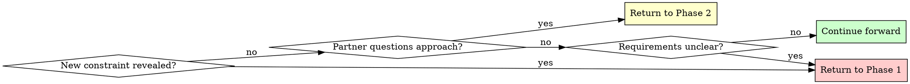

# Brainstorming Ideas Into Designs

## Overview

Transform rough ideas into fully-formed designs through structured questioning, alternative exploration, and codebase awareness.

**Core principle:** Ask questions to understand, explore alternatives, present design incrementally for validation, and research existing codebase patterns.

**Announce at start:** "I'm using the brainstorming skill to refine your idea into a design."

## Codebase Integration

### Serena MCP (Understanding Code Patterns)
Before proposing architectural approaches, **use Serena** to understand how similar features are implemented in the codebase:

1. **Early exploration (Phase 1):** Use Serena to explore existing patterns that might influence design constraints
   - Example: If brainstorming authentication, check how auth is currently handled
   - Use `find_symbol` to find authentication-related code
   - Use `search_for_pattern` for similar implementations

2. **Approach evaluation (Phase 2):** Reference existing patterns when proposing alternatives
   - Say: "I found that the codebase currently uses [pattern], so approach 1 would align with existing conventions"
   - Use patterns you discover to make recommendations more grounded

3. **Design grounding (Phase 3):** When presenting the design, reference how it integrates with existing codebase
   - Reference specific files and existing patterns
   - Use `find_referencing_symbols` to understand dependencies

**When to use Serena:**
- For existing projects with established patterns
- When design should align with current architecture
- When you need to understand constraints from how code is structured
- When brainstorming involves integrating with existing systems

### Graphiti MCP (Contextual Knowledge)
Use Graphiti to enrich understanding of business context, entity relationships, and learned patterns:

1. **Context gathering (Phase 1):** Search Graphiti for relevant business context
   - Example: "What patterns exist around user authentication in this business context?"
   - Use `search_memory_nodes` and `search_memory_facts` to find relevant entities and relationships

2. **Alternative grounding (Phase 2):** When proposing approaches, reference knowledge about similar past decisions
   - Say: "Based on [previous project/decision], we should consider..."
   - Use graph memory to reference past successful patterns

3. **Design enrichment (Phase 3):** Ensure design aligns with established business rules and patterns
   - Use graph memory to validate that design respects known constraints
   - Reference discovered relationships between entities

**When to use Graphiti:**
- For business logic design (tax, financial, compliance features)
- When design needs to respect established patterns
- When understanding multi-entity relationships
- When brainstorming touches learned business rules

**Note:** If you encounter "stale connection" errors with Graphiti, continue with available information and note the limitation.

## Quick Reference

| Phase | Key Activities | Tool Usage | Output |
|-------|---------------|------------|--------|
| **1. Understanding** | Ask questions (one at a time); explore codebase patterns | AskUserQuestion for choices; Serena/Graphiti for context | Purpose, constraints, criteria, existing patterns |
| **2. Exploration** | Propose 2-3 approaches grounded in codebase | AskUserQuestion for approach selection; Serena patterns | Architecture options with trade-offs, aligned with codebase |
| **3. Design Presentation** | Present in 200-300 word sections; reference patterns | Open-ended questions; design-codebase integration | Complete design with validation, codebase-aware |
| **4. Design Documentation** | Write design document | writing-clearly-and-concisely skill | Design doc in docs/plans/ |
| **5. Worktree Setup** | Set up isolated workspace | using-git-worktrees skill | Ready development environment |
| **6. Planning Handoff** | Create implementation plan | writing-plans skill | Detailed task breakdown |

## The Process

Copy this checklist to track progress:

```
Brainstorming Progress:
- [ ] Phase 1: Understanding (purpose, constraints, criteria gathered)
- [ ] Phase 2: Exploration (2-3 approaches proposed and evaluated)
- [ ] Phase 3: Design Presentation (design validated in sections)
- [ ] Phase 4: Design Documentation (design written to docs/plans/)
- [ ] Phase 5: Worktree Setup (if implementing)
- [ ] Phase 6: Planning Handoff (if implementing)
```

### Phase 1: Understanding
- Check current project state in working directory
- **Use Serena to explore existing patterns** in the codebase (if applicable)
- **Use Graphiti to gather business context** and understand established patterns
- Ask ONE question at a time to refine the idea
- **Use AskUserQuestion tool** when you have multiple choice options
- Gather: Purpose, constraints, success criteria

**Example with Serena integration:**
```
User: "We need to add real-time notifications to the system"

Claude: Let me first explore how notifications are currently handled in the codebase...
[Uses Serena: find_symbol for "notification", find_referencing_symbols]

I found that notifications are currently handled through [existing pattern].
This means we should consider:
- Whether to extend the existing pattern or create a new approach
- Dependencies on the current notification system
- Current notification types in use
```

**Example using AskUserQuestion:**
```
Question: "Where should the authentication data be stored?"
Options:
  - "Session storage" (clears on tab close, more secure)
  - "Local storage" (persists across sessions, more convenient)
  - "Cookies" (works with SSR, compatible with older approach)
```

### Phase 2: Exploration
- **Use Serena to understand existing architectural patterns** in the codebase
- Propose 2-3 different approaches grounded in what you discovered
- For each: Core architecture, trade-offs, complexity assessment
- **Reference existing patterns** from the codebase in your proposals
- **Use AskUserQuestion tool** to present approaches as structured choices
- Ask your human partner which approach resonates

**Example with codebase grounding:**
```
Based on exploring the codebase, I found that [system X] uses [pattern].

Approach 1: Extend pattern used in [system X]
- Pros: Consistent with existing architecture, team familiar
- Cons: May not be optimal for this use case
- Alignment: High - uses established patterns

Approach 2: New pattern optimized for real-time
- Pros: Tailored for requirements, modern architecture
- Cons: New pattern team needs to learn, potential inconsistency
- Alignment: Low - introduces new pattern

Approach 3: Hybrid - adapt [pattern from X] with [technique from Y]
- Pros: Leverages familiar pattern, adds optimizations
- Cons: Moderate complexity, blends two approaches
- Alignment: Medium - extends existing pattern thoughtfully
```

**Example using AskUserQuestion:**
```
Question: "Which architectural approach should we use?"
Options:
  - "Event-driven with message queue" (scalable, complex setup, eventual consistency)
  - "Direct API calls with retry logic" (simple, synchronous, easier to debug)
  - "Hybrid with background jobs" (balanced, moderate complexity, best of both)
```

### Phase 3: Design Presentation
- Present in 200-300 word sections
- Cover: Architecture, components, data flow, error handling, testing
- **Reference specific files and patterns** discovered from Serena
- **Include codebase integration points** - how this design connects to existing systems
- Ask after each section: "Does this look right so far?" (open-ended)
- Use open-ended questions here to allow freeform feedback

**When presenting design sections, include:**
- "In our codebase, this integrates with [file/module] because..."
- "We're leveraging the existing [pattern] from [file] for [reason]"
- "This extends the [existing feature] in [location] by..."
- "The data flow follows our established pattern used in [similar feature]"

### Phase 4: Design Documentation
After design is validated, write it to a permanent document:
- **File location:** `docs/plans/YYYY-MM-DD-<topic>-design.md` (use actual date and descriptive topic)
- **RECOMMENDED SUB-SKILL:** Use elements-of-style:writing-clearly-and-concisely (if available) for documentation quality
- **Content:** Capture the design as discussed and validated in Phase 3, organized into the sections that emerged from the conversation
- Commit the design document to git before proceeding

### Phase 5: Worktree Setup (for implementation)
When design is approved and implementation will follow:
- Announce: "I'm using the using-git-worktrees skill to set up an isolated workspace."
- **REQUIRED SUB-SKILL:** Use superpowers:using-git-worktrees
- Follow that skill's process for directory selection, safety verification, and setup
- Return here when worktree ready

### Phase 6: Planning Handoff
Ask: "Ready to create the implementation plan?"

When your human partner confirms (any affirmative response):
- Announce: "I'm using the writing-plans skill to create the implementation plan."
- **REQUIRED SUB-SKILL:** Use superpowers:writing-plans
- Create detailed plan in the worktree

## Question Patterns

### When to Use AskUserQuestion Tool

**Use AskUserQuestion for:**
- Phase 1: Clarifying questions with 2-4 clear options
- Phase 2: Architectural approach selection (2-3 alternatives)
- Any decision with distinct, mutually exclusive choices
- When options have clear trade-offs to explain

**Benefits:**
- Structured presentation of options with descriptions
- Clear trade-off visibility for partner
- Forces explicit choice (prevents vague "maybe both" responses)

### When to Use Open-Ended Questions

**Use open-ended questions for:**
- Phase 3: Design validation ("Does this look right so far?")
- When you need detailed feedback or explanation
- When partner should describe their own requirements
- When structured options would limit creative input

**Example decision flow:**
- "What authentication method?" → Use AskUserQuestion (2-4 options)
- "Does this design handle your use case?" → Open-ended (validation)

## When to Revisit Earlier Phases



**You can and should go backward when:**
- Partner reveals new constraint during Phase 2 or 3 → Return to Phase 1
- Validation shows fundamental gap in requirements → Return to Phase 1
- Partner questions approach during Phase 3 → Return to Phase 2
- Something doesn't make sense → Go back and clarify

**Don't force forward linearly** when going backward would give better results.

## Key Principles

| Principle | Application |
|-----------|-------------|
| **Codebase-aware design** | Use Serena to explore patterns; ground proposals in what exists |
| **Context-informed decisions** | Use Graphiti to understand business patterns and constraints |
| **One question at a time** | Phase 1: Single question per message, use AskUserQuestion for choices |
| **Structured choices** | Use AskUserQuestion tool for 2-4 options with trade-offs |
| **YAGNI ruthlessly** | Remove unnecessary features from all designs |
| **Explore alternatives** | Always propose 2-3 approaches before settling |
| **Reference existing patterns** | When proposing design, cite specific files and patterns found in codebase |
| **Incremental validation** | Present design in sections, validate each |
| **Flexible progression** | Go backward when needed - flexibility > rigidity |
| **Announce usage** | State skill usage at start of session (including which tools you're using) |
