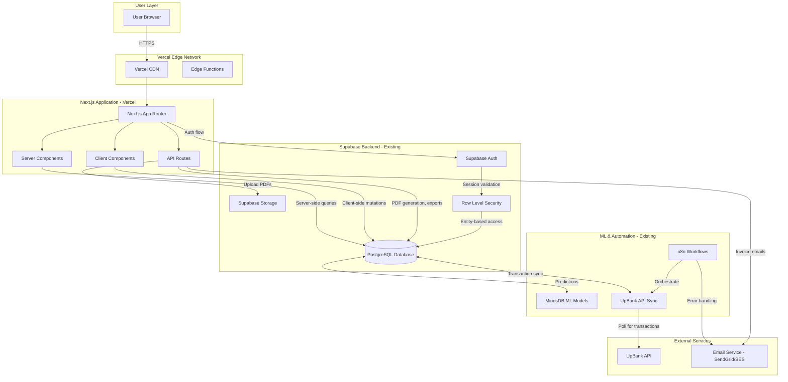
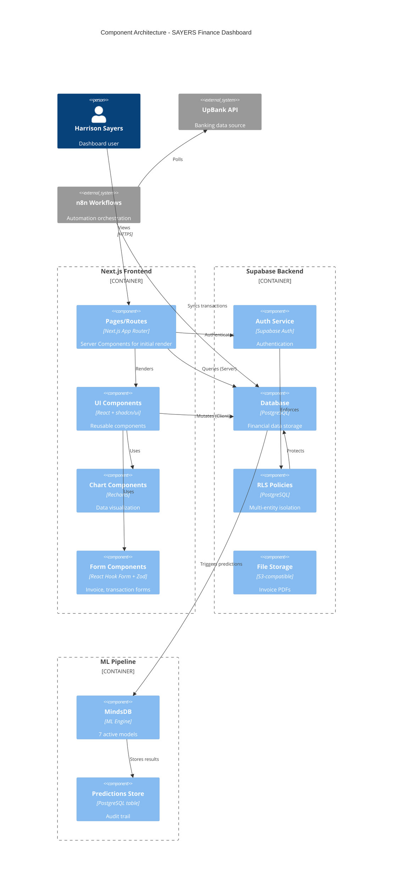
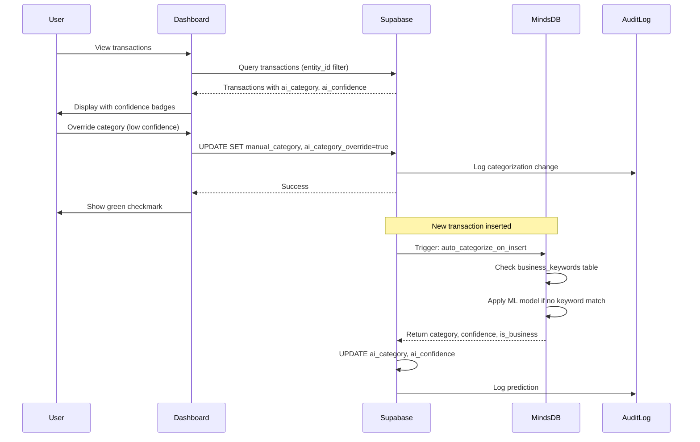
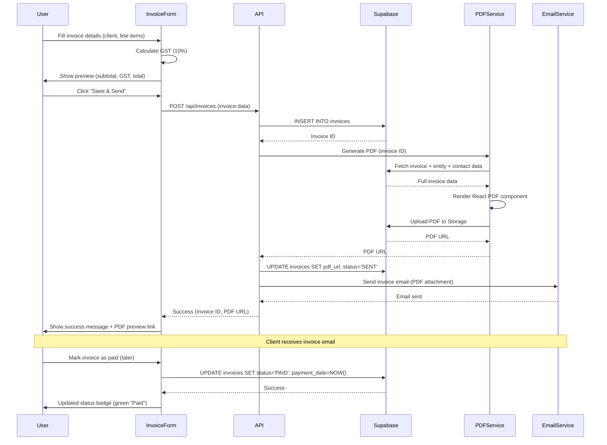
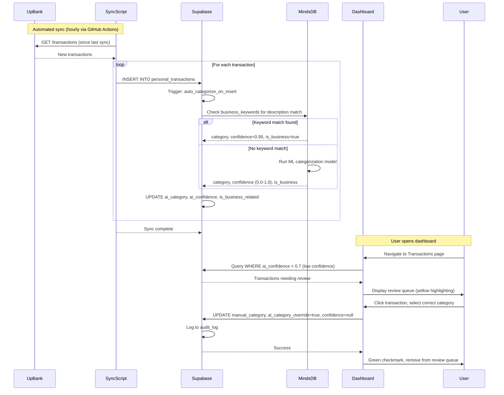
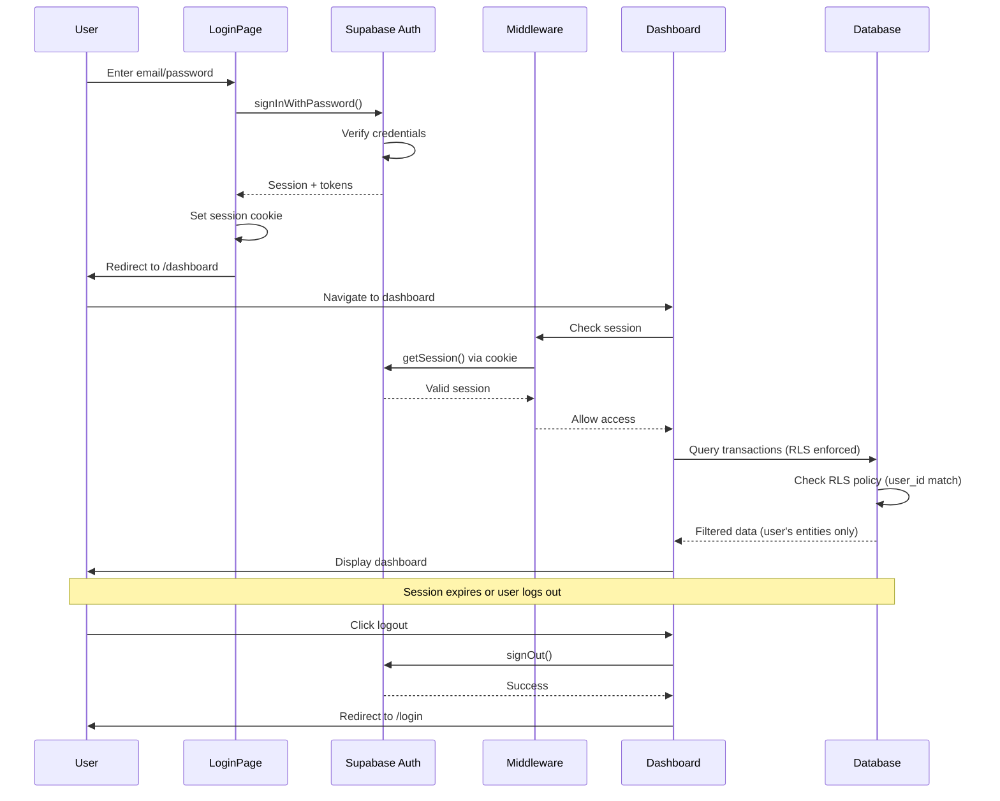
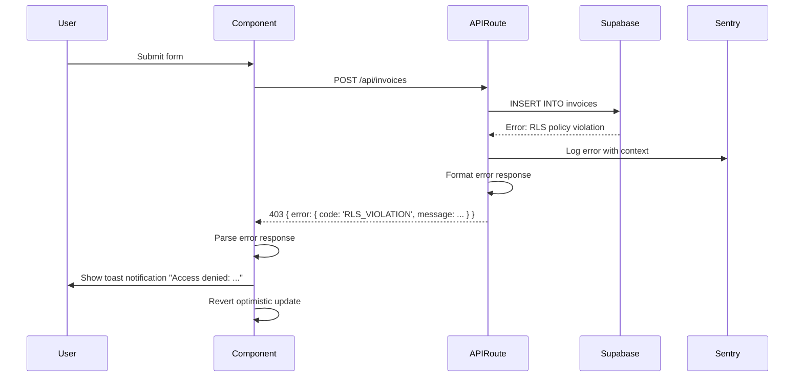

# SAYERS Finance Dashboard Architecture Document

<!-- Powered by BMAD™ Core -->

## Change Log

| Date | Version | Description | Author |
|------|---------|-------------|--------|
| 2025-10-03 | 1.0 | Initial architecture document | Harrison Robert Sayers |

---

## Introduction

This document outlines the complete fullstack architecture for the **SAYERS Finance Dashboard**, a comprehensive financial management application built on Next.js 14+ and Supabase. It serves as the single source of truth for AI-driven development, ensuring consistency across the entire technology stack.

This unified architecture combines backend systems (Supabase database, ML pipeline, API integrations) with frontend implementation (Next.js App Router, React components, data visualization), streamlining development for a modern fullstack application where these concerns are tightly coupled.

### Project Foundation

**Greenfield Project**: This is a new Next.js application that will leverage existing Supabase infrastructure. The database schema, ML models, and automation workflows already exist and are production-ready. The dashboard will be a new frontend interface connecting to this mature backend.

**Existing Infrastructure**:
- Supabase project `gshsshaodoyttdxippwx` (SAYERS DATA) with 13 tables
- UpBank sync automation (GitHub Actions + n8n)
- MindsDB ML pipeline with 7 active models
- Personal banking transactions (230+ records)
- Business invoices (29 records)
- Multi-entity accounting (MOKAI, MOK HOUSE, Harrison Sayers)

**Project Goals**:
- Provide real-time visibility into financial performance across entities
- Reduce manual bookkeeping by 80% through ML automation
- Enable one-click tax compliance reporting (BAS, P&L)
- Surface financial anomalies proactively
- Streamline invoice management workflows

---

## High Level Architecture

### Technical Summary

The SAYERS Finance Dashboard is a **server-rendered Next.js 14+ application** deployed on Vercel, leveraging the **App Router** for optimal performance with React Server Components. The frontend connects to **Supabase** (existing PostgreSQL database) for all data operations, utilizing Row Level Security (RLS) for multi-entity data isolation. The architecture follows a **Jamstack pattern** with server-side data fetching and client-side interactivity only where needed (charts, forms, filters). **MindsDB ML models** provide categorization and anomaly detection with predictions stored in Supabase, while **Recharts** handles data visualization. Authentication is handled via **Supabase Auth**, and the entire stack is optimized for Australian tax compliance requirements (GST, BAS reporting). This architecture achieves PRD goals by combining existing backend intelligence with a new, performant frontend interface that prioritizes data accuracy, user efficiency, and regulatory compliance.

### Platform and Infrastructure Choice

After evaluating options, the recommended platform is:

**Platform**: **Vercel + Supabase** (existing infrastructure)

**Rationale**:
- **Vercel**: Native Next.js optimization, automatic deployments, edge functions, built-in CDN
- **Supabase**: Existing production database with 13 tables, RLS policies, ML integration already configured
- **Cost-effective**: Leverages existing Supabase infrastructure, no migration required
- **Proven stack**: Currently running UpBank sync automations successfully

**Key Services**:
- **Frontend Hosting**: Vercel (automatic deployments from GitHub)
- **Database**: Supabase PostgreSQL (`gshsshaodoyttdxippwx`)
- **Authentication**: Supabase Auth
- **File Storage**: Supabase Storage (for invoice PDFs, receipts)
- **ML Engine**: MindsDB (already integrated with Supabase)
- **CDN**: Vercel Edge Network
- **Monitoring**: Vercel Analytics, Sentry (error tracking)

**Deployment Host and Regions**:
- **Primary**: Vercel Sydney (Australia) for optimal latency
- **Database**: Supabase (AWS Sydney) - existing deployment
- **CDN**: Global edge network via Vercel

### Repository Structure

**Structure**: **Monorepo** (single Next.js application)

**Rationale**:
- Project scope fits monolith pattern perfectly
- No need for separate frontend/backend repos (Supabase is backend)
- Simpler deployment and CI/CD
- Shared types between components and API routes

**Monorepo Tool**: **npm workspaces** (optional) or standard Next.js structure

**Package Organization**:
```
/
├── app/                # Next.js App Router
├── components/         # React components
├── lib/               # Utilities, Supabase client
├── types/             # TypeScript types (shared)
├── hooks/             # Custom React hooks
├── public/            # Static assets
```

No need for complex monorepo tooling (Turborepo, Nx) at this scale. Standard Next.js project structure is sufficient.

### High Level Architecture Diagram



### Architectural Patterns

- **Jamstack Architecture**: Static-first with dynamic data fetching via Server Components - *Rationale*: Optimal performance for content-heavy dashboards with real-time data requirements
- **Server Components First**: Default to React Server Components, use Client Components only for interactivity - *Rationale*: Reduces JavaScript bundle, improves initial load times, maintains type safety
- **Repository Pattern**: Abstract Supabase queries into service layer functions - *Rationale*: Enables testing, centralizes query logic, simplifies component code
- **API Gateway Pattern**: All external integrations (UpBank, ML) accessed via Next.js API routes - *Rationale*: Centralizes error handling, rate limiting, and logging
- **Optimistic UI Updates**: Client mutations show immediate UI updates before server confirmation - *Rationale*: Improves perceived performance for user actions (categorization, status changes)
- **Command Query Responsibility Segregation (CQRS)**: Separate read (Server Components) from write (Server Actions) operations - *Rationale*: Clear data flow, optimized caching strategies

---

## Tech Stack

This is the DEFINITIVE technology selection for the entire project. All development must use these exact versions.

| Category | Technology | Version | Purpose | Rationale |
|----------|-----------|---------|---------|-----------|
| Frontend Language | TypeScript | 5.3+ | Type-safe JavaScript | Industry standard for large React applications, prevents runtime errors |
| Frontend Framework | Next.js | 14.2+ | React meta-framework with App Router | Server Components, streaming, built-in optimization, Vercel integration |
| UI Component Library | shadcn/ui | Latest | Radix UI + Tailwind components | Accessible, customizable, well-documented, perfect for financial dashboards |
| State Management | React Context + Server Components | N/A | Global state and server state | Minimal client state needed, Server Components handle most data fetching |
| Backend Language | TypeScript | 5.3+ | Type-safe server code | Shared types between frontend and backend |
| Backend Framework | Supabase (PostgreSQL) | Existing | BaaS with auth, database, storage | Existing production database with RLS, no migration needed |
| API Style | REST (Next.js API Routes) | N/A | Server-side operations | PDF generation, CSV exports, webhook handlers |
| Database | Supabase PostgreSQL | 15+ | Relational database | Existing infrastructure with 13 tables, RLS policies, ML integration |
| Cache | Next.js Cache (React Cache) | N/A | Server-side caching | Built-in caching for Server Components, revalidation on demand |
| File Storage | Supabase Storage | N/A | Invoice PDFs, receipts | Integrated with Supabase, S3-compatible, existing setup |
| Authentication | Supabase Auth | N/A | Email/password, session management | Existing auth system, RLS integration, secure session cookies |
| Frontend Testing | Vitest | 1.0+ | Unit tests for utilities, calculations | Fast, Vite-powered, TypeScript support, compatible with React Testing Library |
| Backend Testing | Vitest | 1.0+ | API route tests, service layer tests | Same tooling as frontend for consistency |
| E2E Testing | Playwright | 1.40+ | Critical user journeys | Reliable, cross-browser, great debugging tools |
| Build Tool | Next.js (Webpack) | N/A | Bundling and compilation | Built into Next.js, optimized for App Router |
| Bundler | Turbopack (Next.js 14+) | N/A | Fast development builds | Next.js default, faster than Webpack in dev mode |
| IaC Tool | N/A | N/A | Infrastructure as code | Not needed, Vercel handles infrastructure |
| CI/CD | GitHub Actions | N/A | Automated testing and deployment | Existing setup for UpBank sync, add test/deploy workflows |
| Monitoring | Vercel Analytics + Sentry | N/A | Performance and error tracking | Built-in analytics, Sentry for error alerting |
| Logging | Vercel Logs + Supabase Logs | N/A | Application and database logs | Built-in logging, queryable via dashboard |
| CSS Framework | Tailwind CSS | 3.4+ | Utility-first styling | shadcn/ui dependency, fast development, small bundle |
| Charts Library | Recharts | 2.10+ | Data visualization | React-based, composable, supports all chart types needed |
| Form Management | React Hook Form | 7.49+ | Form state and validation | Performant, minimal re-renders, great DX |
| Schema Validation | Zod | 3.22+ | Runtime type validation | TypeScript-first, integrates with React Hook Form |
| PDF Generation | @react-pdf/renderer | 3.3+ | Invoice PDF creation | React-based, declarative, server-side rendering |
| Date Utilities | date-fns | 3.0+ | Date manipulation and formatting | Lightweight, tree-shakeable, Australia/Sydney timezone support |
| Data Export | papaparse | 5.4+ | CSV generation | Fast, reliable, handles large datasets |
| Decimal Math | decimal.js | 10.4+ | Precise financial calculations | Avoids floating-point errors, critical for GST calculations |

---

## Data Models

These are the core conceptual data models shared between frontend and backend. They map directly to existing Supabase tables.

### Entity

**Purpose**: Represents business entities (MOKAI PTY LTD, MOK HOUSE PTY LTD, Harrison Sayers) with multi-entity accounting support.

**Key Attributes**:
- `id`: UUID - Primary identifier
- `name`: string - Entity name
- `abn`: string - Australian Business Number (11 digits)
- `entity_type`: enum - "PTY LTD", "Sole Trader", "Partnership", "Trust"
- `is_indigenous_owned`: boolean - Indigenous business status (for IPP eligibility)
- `address`: string - Business address
- `bank_details`: JSON - BSB, account number, account name

**TypeScript Interface**:

```typescript
interface Entity {
  id: string; // UUID
  name: string;
  abn: string | null;
  acn: string | null;
  entity_type: 'PTY LTD' | 'Sole Trader' | 'Partnership' | 'Trust';
  is_indigenous_owned: boolean;
  address: string | null;
  city: string | null;
  state: string | null;
  postcode: string | null;
  country: string;
  phone: string | null;
  email: string | null;
  website: string | null;
  bank_details: {
    bank_name?: string;
    bsb?: string;
    account_number?: string;
    account_name?: string;
  } | null;
  logo_url: string | null;
  created_at: string; // ISO 8601
  updated_at: string; // ISO 8601
}
```

**Relationships**:
- Has many `BankAccount`
- Has many `Transaction`
- Has many `Invoice`
- Has many `Contact` (via entity assignments)

### Transaction

**Purpose**: Financial transactions from UpBank sync with ML categorization and anomaly detection.

**Key Attributes**:
- `id`: UUID - Primary identifier
- `entity_id`: UUID - Foreign key to Entity
- `description`: string - Transaction description
- `amount_cents`: number - Amount in cents (negative = expense, positive = income)
- `transaction_date`: Date - When transaction occurred
- `ai_category`: string | null - ML-predicted category
- `ai_confidence`: number | null - Confidence score (0.00-1.00)
- `anomaly_score`: number | null - Anomaly detection score
- `is_business_related`: boolean - Auto-detected business expense flag
- `is_tax_deductible`: boolean - Tax optimization flag

**TypeScript Interface**:

```typescript
interface Transaction {
  id: string; // UUID
  entity_id: string; // UUID
  account_id: string; // UUID - Foreign key to BankAccount
  upbank_transaction_id: string | null; // If synced from UpBank

  // Core fields
  description: string;
  amount_cents: number; // Negative = expense, positive = income
  currency_code: string; // 'AUD'
  transaction_date: string; // ISO 8601
  status: 'HELD' | 'SETTLED' | 'CANCELLED';

  // Categorization
  ai_category: string | null; // ML prediction
  ai_confidence: number | null; // 0.00-1.00
  manual_category: string | null; // User override
  ai_category_override: boolean; // True if user corrected ML

  // ML insights
  anomaly_score: number | null; // 0.00-1.00
  is_business_related: boolean;
  is_tax_deductible: boolean;
  ml_features: Record<string, any> | null; // Feature vector

  // Metadata
  merchant_name: string | null;
  reference: string | null;
  notes: string | null;
  tags: string[];

  // Timestamps
  created_at: string; // ISO 8601
  updated_at: string; // ISO 8601
  settled_at: string | null; // ISO 8601
}
```

**Relationships**:
- Belongs to `Entity`
- Belongs to `BankAccount`
- Has many `TransactionLine` (double-entry accounting)
- Has many `AIPrediction` (audit trail)

### Invoice

**Purpose**: Receivables (sent to clients) and payables (received from suppliers) with payment tracking.

**Key Attributes**:
- `id`: UUID - Primary identifier
- `entity_id`: UUID - Foreign key to Entity
- `contact_id`: UUID - Foreign key to Contact (client/supplier)
- `invoice_number`: string - Auto-generated or manual
- `invoice_type`: enum - "RECEIVABLE", "PAYABLE"
- `status`: enum - "DRAFT", "SENT", "PAID", "OVERDUE", "CANCELLED"
- `issue_date`: Date - Invoice issue date
- `due_date`: Date - Payment due date
- `subtotal_cents`: number - Amount before GST
- `gst_cents`: number - GST amount (10% in Australia)
- `total_cents`: number - Total including GST

**TypeScript Interface**:

```typescript
interface Invoice {
  id: string; // UUID
  entity_id: string; // UUID
  contact_id: string; // UUID

  // Invoice details
  invoice_number: string;
  invoice_type: 'RECEIVABLE' | 'PAYABLE';
  status: 'DRAFT' | 'SENT' | 'PAID' | 'OVERDUE' | 'CANCELLED' | 'PARTIALLY_PAID';

  // Dates
  issue_date: string; // ISO 8601
  due_date: string; // ISO 8601
  payment_date: string | null; // ISO 8601

  // Amounts
  subtotal_cents: number;
  gst_cents: number; // 10% GST
  total_cents: number;
  amount_paid_cents: number; // For partial payments

  // Payment details
  payment_terms: string | null; // "Net 30", "Net 60", etc.
  payment_method: string | null; // "Bank Transfer", "Credit Card", etc.
  payment_reference: string | null;

  // Metadata
  description: string | null;
  notes: string | null;
  pdf_url: string | null; // Supabase Storage URL

  // Line items (denormalized for quick access)
  line_items: InvoiceLineItem[];

  // Timestamps
  created_at: string; // ISO 8601
  updated_at: string; // ISO 8601
}

interface InvoiceLineItem {
  id: string; // UUID
  invoice_id: string; // UUID
  description: string;
  quantity: number;
  unit_price_cents: number;
  gst_applicable: boolean;
  amount_cents: number; // quantity * unit_price_cents
}
```

**Relationships**:
- Belongs to `Entity`
- Belongs to `Contact`
- Has many `InvoiceLineItem`

### Contact

**Purpose**: Customers (invoice recipients) and suppliers (vendors) for entity relationships.

**Key Attributes**:
- `id`: UUID - Primary identifier
- `entity_id`: UUID - Foreign key to Entity
- `name`: string - Contact name
- `abn`: string | null - Australian Business Number
- `contact_type`: enum - "CUSTOMER", "SUPPLIER", "BOTH"
- `email`: string | null - Email address
- `phone`: string | null - Phone number

**TypeScript Interface**:

```typescript
interface Contact {
  id: string; // UUID
  entity_id: string; // UUID

  // Contact details
  name: string;
  abn: string | null;
  acn: string | null;
  contact_type: 'CUSTOMER' | 'SUPPLIER' | 'BOTH';

  // Contact information
  email: string | null;
  phone: string | null;
  address: string | null;
  city: string | null;
  state: string | null;
  postcode: string | null;
  country: string;

  // Metadata
  notes: string | null;
  is_active: boolean;
  archived_at: string | null; // ISO 8601

  // Timestamps
  created_at: string; // ISO 8601
  updated_at: string; // ISO 8601
}
```

**Relationships**:
- Belongs to `Entity`
- Has many `Invoice`

### Account (Chart of Accounts)

**Purpose**: Australian chart of accounts for categorization and tax compliance.

**Key Attributes**:
- `id`: UUID - Primary identifier
- `code`: string - Account code (e.g., "4000", "5100")
- `name`: string - Account name (e.g., "Sales Revenue", "Office Expenses")
- `account_type`: enum - "ASSET", "LIABILITY", "EQUITY", "REVENUE", "EXPENSE"
- `tax_treatment`: enum - "GST_ON_INCOME", "GST_ON_EXPENSES", "GST_FREE", "INPUT_TAXED", "NOT_REPORTABLE"
- `is_active`: boolean - Active/inactive status

**TypeScript Interface**:

```typescript
interface Account {
  id: string; // UUID
  code: string;
  name: string;
  account_type: 'ASSET' | 'LIABILITY' | 'EQUITY' | 'REVENUE' | 'EXPENSE';
  tax_treatment: 'GST_ON_INCOME' | 'GST_ON_EXPENSES' | 'GST_FREE' | 'INPUT_TAXED' | 'NOT_REPORTABLE';
  parent_account_id: string | null; // UUID - For hierarchical accounts
  description: string | null;
  is_active: boolean;

  // Timestamps
  created_at: string; // ISO 8601
  updated_at: string; // ISO 8601
}
```

**Relationships**:
- Self-referencing (parent-child hierarchy)
- Has many `TransactionLine`

---

## API Specification

The application uses **Next.js API Routes** for server-side operations. These are REST-style endpoints but not a traditional REST API.

### API Routes Structure

```
/api/
├── invoices/
│   ├── [id]/
│   │   └── pdf/          # GET - Generate invoice PDF
│   └── route.ts          # POST - Create invoice
├── reports/
│   ├── bas/              # POST - Generate BAS report
│   ├── income-statement/ # POST - Generate P&L report
│   └── export/           # POST - Export transactions CSV
├── transactions/
│   ├── categorize/       # POST - Bulk categorize transactions
│   └── split/            # POST - Split transaction
└── webhooks/
    └── upbank/           # POST - UpBank sync webhook
```

### Key Endpoints

#### Invoice PDF Generation

```typescript
// GET /api/invoices/[id]/pdf
// Generates PDF for invoice and returns download stream

interface Response {
  // Returns PDF binary stream with headers:
  // Content-Type: application/pdf
  // Content-Disposition: attachment; filename="invoice-{number}.pdf"
}
```

#### Transaction Export

```typescript
// POST /api/reports/export
interface Request {
  format: 'csv' | 'excel';
  filters: {
    entity_id: string;
    start_date: string; // ISO 8601
    end_date: string; // ISO 8601
    category?: string;
    confidence_min?: number;
  };
  columns: string[]; // Column selection
}

interface Response {
  // Returns CSV/Excel binary stream with headers:
  // Content-Type: text/csv or application/vnd.openxmlformats-officedocument.spreadsheetml.sheet
  // Content-Disposition: attachment; filename="transactions-{date}.{format}"
}
```

#### BAS Report Generation

```typescript
// POST /api/reports/bas
interface Request {
  entity_id: string;
  quarter: 1 | 2 | 3 | 4; // Q1-Q4
  fiscal_year: number; // e.g., 2025
}

interface Response {
  bas_data: {
    // G-fields from BAS form
    G1_total_sales_cents: number;
    G2_export_sales_cents: number;
    G3_gst_free_sales_cents: number;
    G10_capital_purchases_cents: number;
    G11_non_capital_purchases_cents: number;
    // ... more BAS fields

    // GST calculations
    field_1A_gst_on_sales_cents: number;
    field_1B_gst_on_purchases_cents: number;
    field_7_net_gst_cents: number; // Amount owed or refund
  };
  supporting_transactions: {
    [field: string]: Transaction[]; // Transactions contributing to each field
  };
}
```

### Authentication Pattern

All API routes use Supabase Auth middleware:

```typescript
// middleware.ts
import { createServerClient } from '@supabase/ssr'

export async function middleware(request: NextRequest) {
  const supabase = createServerClient(
    process.env.NEXT_PUBLIC_SUPABASE_URL!,
    process.env.NEXT_PUBLIC_SUPABASE_ANON_KEY!,
    { cookies: { get: (name) => request.cookies.get(name)?.value } }
  )

  const { data: { session } } = await supabase.auth.getSession()

  if (!session && request.nextUrl.pathname.startsWith('/api')) {
    return new Response('Unauthorized', { status: 401 })
  }

  return NextResponse.next()
}
```

---

## Components

### Frontend Components

#### Dashboard Overview Component

**Responsibility**: Displays KPI cards, trend charts, recent transactions widget, and anomaly alerts for selected entity.

**Key Interfaces**:
- `getDashboardData(entityId: string, dateRange: DateRange): Promise<DashboardData>`
- `refreshDashboard(): void`

**Dependencies**:
- Supabase client (read-only queries)
- Recharts (for visualization)
- Entity context (global state)

**Technology Stack**: React Server Component (default), Client Components for charts and date picker

#### Transaction List Component

**Responsibility**: Paginated transaction table with filtering, search, inline editing, and bulk operations.

**Key Interfaces**:
- `getTransactions(filters: TransactionFilters, pagination: Pagination): Promise<TransactionPage>`
- `updateCategory(transactionId: string, category: string): Promise<void>`
- `bulkCategorize(transactionIds: string[], category: string): Promise<void>`

**Dependencies**:
- Supabase client (queries + mutations)
- React Hook Form (for filters)
- Virtual scrolling library (if >100 transactions)

**Technology Stack**: Mixed - Server Component for initial render, Client Component for filters and table interactions

#### Invoice Form Component

**Responsibility**: Multi-step invoice creation with line items, GST calculation, PDF preview.

**Key Interfaces**:
- `createInvoice(data: InvoiceFormData): Promise<Invoice>`
- `generatePDF(invoice: Invoice): Promise<string>` (calls API route)
- `validateGST(lineItems: LineItem[]): { subtotal: number; gst: number; total: number }`

**Dependencies**:
- React Hook Form + Zod validation
- Supabase client (create invoice mutation)
- Contact selector (autocomplete)

**Technology Stack**: Client Component (complex form interactions)

#### Chart Components

**Responsibility**: Reusable chart wrappers for revenue/expense trends, category breakdowns, anomaly timelines.

**Key Interfaces**:
- `<TrendChart data={ChartData[]} />` - Line chart for time series
- `<CategoryPieChart data={CategoryData[]} />` - Pie chart for category breakdown
- `<AnomalyTimelineChart data={AnomalyData[]} />` - Scatter plot for anomalies

**Dependencies**:
- Recharts library
- shadcn/ui Card wrapper

**Technology Stack**: Client Components (Recharts requires client-side rendering)

### Backend Components (Supabase)

#### Transaction Categorization Service

**Responsibility**: ML-powered transaction categorization using MindsDB models.

**Key Interfaces**:
- `predict_transaction_category(amount, description, vendor)` (PostgreSQL function)
- Database trigger `auto_categorize_on_insert` (automatic categorization)

**Dependencies**:
- MindsDB integration
- `business_keywords` table for keyword matching
- `ml_models` table for model registry

**Technology Stack**: PostgreSQL functions, MindsDB SQL queries

#### BAS Calculation Service

**Responsibility**: Generate Australian Business Activity Statement data from transactions.

**Key Interfaces**:
- `/lib/reports/bas.ts` - `calculateBAS(entityId, quarter, year)` function
- SQL queries aggregating transactions by GST treatment

**Dependencies**:
- Supabase client (complex aggregation queries)
- `accounts` table (tax treatment definitions)
- `transactions` and `invoices` tables

**Technology Stack**: TypeScript service layer, PostgreSQL aggregations

#### PDF Generation Service

**Responsibility**: Server-side invoice PDF creation with Australian tax compliance formatting.

**Key Interfaces**:
- `/lib/pdf/invoice.tsx` - React component defining PDF layout
- `/api/invoices/[id]/pdf` - API route rendering PDF

**Dependencies**:
- @react-pdf/renderer library
- Invoice data from Supabase
- Entity branding assets (logo, colors)

**Technology Stack**: React PDF components, Next.js API Routes

---

## Component Diagrams

### High-Level Component Architecture



### Transaction Categorization Flow



---

## External APIs

### UpBank API

- **Purpose**: Real-time personal banking sync for Harrison's personal accounts
- **Documentation**: https://developer.up.com.au/
- **Base URL**: `https://api.up.com.au/api/v1`
- **Authentication**: Bearer token (Personal Access Token)
- **Rate Limits**: Undocumented, but generally permissive for personal use

**Key Endpoints Used**:
- `GET /accounts` - List all personal accounts
- `GET /accounts/{id}/transactions` - List transactions for account
- `GET /transactions/{id}` - Get single transaction details

**Integration Notes**:
- Existing sync automation via GitHub Actions (daily) + n8n (on-demand)
- Dashboard reads from `personal_transactions` table, does not call API directly
- Sync script: `/scripts/sync-upbank-enhanced.js` with error recovery
- Transactions stored with `upbank_transaction_id` for deduplication

### MindsDB API (Internal)

- **Purpose**: ML model predictions for transaction categorization and anomaly detection
- **Documentation**: https://docs.mindsdb.com/
- **Base URL**: Integrated via SQL interface (Supabase → MindsDB)
- **Authentication**: Not required (internal integration)
- **Rate Limits**: No limits (self-hosted or enterprise plan)

**Key Endpoints Used** (SQL interface):
- `SELECT * FROM mindsdb.transaction_categorizer WHERE description='...'` - Categorization prediction
- `SELECT * FROM mindsdb.anomaly_detector WHERE ...` - Anomaly score

**Integration Notes**:
- Models already trained and deployed
- Predictions triggered via PostgreSQL functions
- Dashboard displays predictions from `ai_predictions` table
- No direct API calls from frontend, all via Supabase

---

## Core Workflows

### Invoice Creation and Payment Workflow



### ML-Powered Transaction Review Workflow



---

## Database Schema

The database schema already exists in Supabase. Below is the reference schema for the dashboard's primary tables:

### Core Tables (SQL DDL Reference)

```sql
-- Entities (MOK HOUSE, MOKAI, Harrison Sayers)
CREATE TABLE entities (
    id UUID PRIMARY KEY DEFAULT gen_random_uuid(),
    name TEXT NOT NULL,
    abn TEXT UNIQUE,
    acn TEXT,
    entity_type TEXT NOT NULL, -- 'PTY LTD', 'Sole Trader', etc.
    is_indigenous_owned BOOLEAN DEFAULT FALSE,
    address TEXT,
    city TEXT,
    state TEXT,
    postcode TEXT,
    country TEXT DEFAULT 'Australia',
    phone TEXT,
    email TEXT,
    website TEXT,
    bank_details JSONB, -- { bank_name, bsb, account_number, account_name }
    logo_url TEXT,
    created_at TIMESTAMPTZ DEFAULT NOW(),
    updated_at TIMESTAMPTZ DEFAULT NOW()
);

-- Personal transactions (from UpBank sync)
CREATE TABLE personal_transactions (
    id UUID PRIMARY KEY DEFAULT gen_random_uuid(),
    upbank_transaction_id TEXT UNIQUE NOT NULL,
    account_id UUID NOT NULL REFERENCES personal_accounts(id),

    -- Transaction details
    description TEXT NOT NULL,
    message TEXT,
    amount_cents INTEGER NOT NULL, -- Negative = expense, positive = income
    currency_code TEXT NOT NULL DEFAULT 'AUD',
    transaction_date TIMESTAMPTZ NOT NULL,
    status TEXT NOT NULL DEFAULT 'SETTLED', -- 'HELD', 'SETTLED', 'CANCELLED'

    -- ML categorization
    ai_category TEXT,
    ai_confidence NUMERIC(5,4), -- 0.0000 to 1.0000
    manual_category TEXT,
    ai_category_override BOOLEAN DEFAULT FALSE,

    -- ML insights
    anomaly_score NUMERIC(5,4),
    is_business_related BOOLEAN DEFAULT FALSE,
    is_tax_deductible BOOLEAN DEFAULT FALSE,
    ml_features JSONB,

    -- Metadata
    merchant_name TEXT,
    reference TEXT,
    notes TEXT,
    tags TEXT[],

    created_at TIMESTAMPTZ DEFAULT NOW(),
    updated_at TIMESTAMPTZ DEFAULT NOW()
);

-- Invoices (receivables and payables)
CREATE TABLE invoices (
    id UUID PRIMARY KEY DEFAULT gen_random_uuid(),
    entity_id UUID NOT NULL REFERENCES entities(id),
    contact_id UUID NOT NULL REFERENCES contacts(id),

    invoice_number TEXT UNIQUE NOT NULL,
    invoice_type TEXT NOT NULL, -- 'RECEIVABLE', 'PAYABLE'
    status TEXT NOT NULL DEFAULT 'DRAFT', -- 'DRAFT', 'SENT', 'PAID', 'OVERDUE', 'CANCELLED', 'PARTIALLY_PAID'

    issue_date DATE NOT NULL,
    due_date DATE NOT NULL,
    payment_date DATE,

    subtotal_cents INTEGER NOT NULL,
    gst_cents INTEGER NOT NULL, -- 10% GST
    total_cents INTEGER NOT NULL,
    amount_paid_cents INTEGER DEFAULT 0,

    payment_terms TEXT,
    payment_method TEXT,
    payment_reference TEXT,

    description TEXT,
    notes TEXT,
    pdf_url TEXT,

    created_at TIMESTAMPTZ DEFAULT NOW(),
    updated_at TIMESTAMPTZ DEFAULT NOW()
);

-- Invoice line items
CREATE TABLE invoice_line_items (
    id UUID PRIMARY KEY DEFAULT gen_random_uuid(),
    invoice_id UUID NOT NULL REFERENCES invoices(id) ON DELETE CASCADE,

    line_order INTEGER NOT NULL,
    description TEXT NOT NULL,
    quantity NUMERIC(10,2) NOT NULL,
    unit_price_cents INTEGER NOT NULL,
    gst_applicable BOOLEAN DEFAULT TRUE,
    amount_cents INTEGER NOT NULL, -- quantity * unit_price_cents

    created_at TIMESTAMPTZ DEFAULT NOW()
);

-- Contacts (customers and suppliers)
CREATE TABLE contacts (
    id UUID PRIMARY KEY DEFAULT gen_random_uuid(),
    entity_id UUID NOT NULL REFERENCES entities(id),

    name TEXT NOT NULL,
    abn TEXT,
    acn TEXT,
    contact_type TEXT NOT NULL, -- 'CUSTOMER', 'SUPPLIER', 'BOTH'

    email TEXT,
    phone TEXT,
    address TEXT,
    city TEXT,
    state TEXT,
    postcode TEXT,
    country TEXT DEFAULT 'Australia',

    notes TEXT,
    is_active BOOLEAN DEFAULT TRUE,
    archived_at TIMESTAMPTZ,

    created_at TIMESTAMPTZ DEFAULT NOW(),
    updated_at TIMESTAMPTZ DEFAULT NOW()
);

-- Chart of accounts
CREATE TABLE accounts (
    id UUID PRIMARY KEY DEFAULT gen_random_uuid(),
    code TEXT UNIQUE NOT NULL,
    name TEXT NOT NULL,
    account_type TEXT NOT NULL, -- 'ASSET', 'LIABILITY', 'EQUITY', 'REVENUE', 'EXPENSE'
    tax_treatment TEXT NOT NULL, -- 'GST_ON_INCOME', 'GST_ON_EXPENSES', 'GST_FREE', 'INPUT_TAXED', 'NOT_REPORTABLE'
    parent_account_id UUID REFERENCES accounts(id),
    description TEXT,
    is_active BOOLEAN DEFAULT TRUE,

    created_at TIMESTAMPTZ DEFAULT NOW(),
    updated_at TIMESTAMPTZ DEFAULT NOW()
);

-- Indexes for performance
CREATE INDEX idx_transactions_entity_date ON personal_transactions(account_id, transaction_date DESC);
CREATE INDEX idx_transactions_confidence ON personal_transactions(ai_confidence) WHERE ai_confidence < 0.7;
CREATE INDEX idx_invoices_entity_status ON invoices(entity_id, status);
CREATE INDEX idx_invoices_due_date ON invoices(due_date) WHERE status NOT IN ('PAID', 'CANCELLED');

-- RLS Policies (Row Level Security)
ALTER TABLE entities ENABLE ROW LEVEL SECURITY;
ALTER TABLE personal_transactions ENABLE ROW LEVEL SECURITY;
ALTER TABLE invoices ENABLE ROW LEVEL SECURITY;
ALTER TABLE contacts ENABLE ROW LEVEL SECURITY;
ALTER TABLE accounts ENABLE ROW LEVEL SECURITY;

-- Example RLS policy (entity-based isolation)
CREATE POLICY "Users can only access their own entity data" ON personal_transactions
    FOR ALL USING (
        account_id IN (
            SELECT id FROM personal_accounts
            WHERE upbank_account_id IN (SELECT upbank_account_id FROM user_accounts WHERE user_id = auth.uid())
        )
    );
```

**Performance Notes**:
- Indexes on `entity_id`, `transaction_date`, `status`, `ai_confidence` for fast filtering
- Composite indexes on `(entity_id, transaction_date)` for dashboard queries
- Partial indexes on low-confidence transactions and overdue invoices
- RLS policies enforced at database level, no application-side filtering needed

---

## Frontend Architecture

### Component Architecture

#### Component Organization

```
/components
├── ui/                      # shadcn/ui base components
│   ├── button.tsx
│   ├── card.tsx
│   ├── input.tsx
│   ├── select.tsx
│   ├── table.tsx
│   ├── badge.tsx
│   └── ...
├── charts/                  # Chart wrappers (Recharts)
│   ├── trend-chart.tsx
│   ├── category-pie-chart.tsx
│   ├── anomaly-timeline.tsx
│   └── chart-card.tsx       # Reusable card wrapper
├── dashboard/               # Dashboard-specific widgets
│   ├── kpi-card.tsx
│   ├── recent-transactions.tsx
│   ├── anomaly-alerts.tsx
│   └── entity-selector.tsx
├── transactions/            # Transaction components
│   ├── transaction-table.tsx
│   ├── transaction-filters.tsx
│   ├── category-badge.tsx
│   └── confidence-indicator.tsx
├── invoices/                # Invoice components
│   ├── invoice-form.tsx
│   ├── invoice-list.tsx
│   ├── line-item-editor.tsx
│   └── gst-calculator.tsx
├── forms/                   # Reusable form components
│   ├── contact-quick-add.tsx
│   ├── date-range-picker.tsx
│   └── entity-selector.tsx
└── layout/                  # Layout components
    ├── header.tsx
    ├── sidebar.tsx
    ├── mobile-nav.tsx
    └── footer.tsx
```

#### Component Template

Standard component pattern for this project:

```typescript
// components/dashboard/kpi-card.tsx
'use client' // Only if client interactivity needed

import { Card, CardContent, CardHeader, CardTitle } from '@/components/ui/card'
import { formatCurrency } from '@/lib/utils'

interface KPICardProps {
  label: string
  value: number // In cents
  icon?: React.ReactNode
  trend?: {
    value: number // Percentage
    direction: 'up' | 'down'
  }
  loading?: boolean
}

export function KPICard({ label, value, icon, trend, loading }: KPICardProps) {
  if (loading) {
    return <KPICardSkeleton />
  }

  return (
    <Card>
      <CardHeader className="flex flex-row items-center justify-between space-y-0 pb-2">
        <CardTitle className="text-sm font-medium">{label}</CardTitle>
        {icon}
      </CardHeader>
      <CardContent>
        <div className="text-2xl font-bold">{formatCurrency(value)}</div>
        {trend && (
          <p className={`text-xs ${trend.direction === 'up' ? 'text-green-600' : 'text-red-600'}`}>
            {trend.direction === 'up' ? '+' : ''}{trend.value}% from last period
          </p>
        )}
      </CardContent>
    </Card>
  )
}

function KPICardSkeleton() {
  return (
    <Card>
      <CardHeader>
        <div className="h-4 w-24 bg-gray-200 rounded animate-pulse" />
      </CardHeader>
      <CardContent>
        <div className="h-8 w-32 bg-gray-200 rounded animate-pulse" />
      </CardContent>
    </Card>
  )
}
```

### State Management Architecture

#### State Structure

```typescript
// lib/contexts/entity-context.tsx
'use client'

import { createContext, useContext, useState, useEffect, ReactNode } from 'react'
import type { Entity } from '@/types/database'

interface EntityContextValue {
  activeEntity: Entity | null
  setActiveEntity: (entity: Entity) => void
  entities: Entity[]
  loading: boolean
}

const EntityContext = createContext<EntityContextValue | undefined>(undefined)

export function EntityProvider({ children, initialEntities }: { children: ReactNode; initialEntities: Entity[] }) {
  const [entities] = useState<Entity[]>(initialEntities)
  const [activeEntity, setActiveEntity] = useState<Entity | null>(() => {
    // Restore from localStorage
    if (typeof window !== 'undefined') {
      const savedId = localStorage.getItem('selectedEntityId')
      return initialEntities.find(e => e.id === savedId) || initialEntities[0] || null
    }
    return initialEntities[0] || null
  })
  const [loading, setLoading] = useState(false)

  useEffect(() => {
    if (activeEntity) {
      // Persist to localStorage
      localStorage.setItem('selectedEntityId', activeEntity.id)
    }
  }, [activeEntity])

  return (
    <EntityContext.Provider value={{ activeEntity, setActiveEntity, entities, loading }}>
      {children}
    </EntityContext.Provider>
  )
}

export function useEntity() {
  const context = useContext(EntityContext)
  if (!context) {
    throw new Error('useEntity must be used within EntityProvider')
  }
  return context
}
```

#### State Management Patterns

- **Global State**: React Context for entity selection, user preferences
- **Server State**: Server Components fetch data, pass as props
- **Form State**: React Hook Form for all forms (transactions, invoices, filters)
- **URL State**: Date ranges, filters, pagination stored in URL query params
- **Optimistic Updates**: Client mutations show immediate UI updates, rollback on error

### Routing Architecture

#### Route Organization

```
/app
├── (auth)/                   # Authentication routes
│   ├── login/
│   │   └── page.tsx
│   └── layout.tsx            # Auth layout (no sidebar)
├── (dashboard)/              # Main dashboard routes
│   ├── layout.tsx            # Dashboard layout (sidebar, header)
│   ├── page.tsx              # Dashboard home
│   ├── transactions/
│   │   ├── page.tsx          # Transaction list
│   │   └── [id]/
│   │       └── page.tsx      # Transaction detail
│   ├── invoices/
│   │   ├── page.tsx          # Invoice list
│   │   ├── new/
│   │   │   └── page.tsx      # Create invoice
│   │   └── [id]/
│   │       ├── page.tsx      # Invoice detail
│   │       └── edit/
│   │           └── page.tsx  # Edit invoice
│   ├── reports/
│   │   ├── bas/
│   │   │   └── page.tsx
│   │   ├── income-statement/
│   │   │   └── page.tsx
│   │   └── export/
│   │       └── page.tsx
│   ├── contacts/
│   │   ├── page.tsx
│   │   └── [id]/
│   │       └── page.tsx
│   ├── accounts/
│   │   └── page.tsx
│   └── settings/
│       ├── page.tsx
│       ├── entities/
│       ├── preferences/
│       ├── audit-log/
│       └── ml-metrics/
├── api/                      # API routes
│   ├── invoices/
│   ├── reports/
│   └── webhooks/
└── layout.tsx                # Root layout
```

#### Protected Route Pattern

```typescript
// middleware.ts
import { createServerClient } from '@supabase/ssr'
import { NextResponse, type NextRequest } from 'next/server'

export async function middleware(request: NextRequest) {
  let response = NextResponse.next({
    request: {
      headers: request.headers,
    },
  })

  const supabase = createServerClient(
    process.env.NEXT_PUBLIC_SUPABASE_URL!,
    process.env.NEXT_PUBLIC_SUPABASE_ANON_KEY!,
    {
      cookies: {
        get(name: string) {
          return request.cookies.get(name)?.value
        },
        set(name: string, value: string, options: CookieOptions) {
          response.cookies.set({
            name,
            value,
            ...options,
          })
        },
        remove(name: string, options: CookieOptions) {
          response.cookies.set({
            name,
            value: '',
            ...options,
          })
        },
      },
    }
  )

  const { data: { session } } = await supabase.auth.getSession()

  // Protected routes
  const isProtectedRoute = request.nextUrl.pathname.startsWith('/dashboard') ||
                          request.nextUrl.pathname.startsWith('/transactions') ||
                          request.nextUrl.pathname.startsWith('/invoices') ||
                          request.nextUrl.pathname.startsWith('/reports') ||
                          request.nextUrl.pathname.startsWith('/api')

  if (isProtectedRoute && !session) {
    const redirectUrl = request.nextUrl.clone()
    redirectUrl.pathname = '/login'
    redirectUrl.searchParams.set('redirectedFrom', request.nextUrl.pathname)
    return NextResponse.redirect(redirectUrl)
  }

  // Already logged in, redirect to dashboard
  if (request.nextUrl.pathname === '/login' && session) {
    return NextResponse.redirect(new URL('/dashboard', request.url))
  }

  return response
}

export const config = {
  matcher: ['/((?!_next/static|_next/image|favicon.ico).*)'],
}
```

### Frontend Services Layer

#### API Client Setup

```typescript
// lib/supabase/client.ts
import { createBrowserClient } from '@supabase/ssr'
import type { Database } from '@/types/supabase'

export function createClient() {
  return createBrowserClient<Database>(
    process.env.NEXT_PUBLIC_SUPABASE_URL!,
    process.env.NEXT_PUBLIC_SUPABASE_ANON_KEY!
  )
}

// lib/supabase/server.ts
import { createServerClient } from '@supabase/ssr'
import { cookies } from 'next/headers'
import type { Database } from '@/types/supabase'

export async function createServerSupabaseClient() {
  const cookieStore = cookies()

  return createServerClient<Database>(
    process.env.NEXT_PUBLIC_SUPABASE_URL!,
    process.env.NEXT_PUBLIC_SUPABASE_ANON_KEY!,
    {
      cookies: {
        get(name: string) {
          return cookieStore.get(name)?.value
        },
      },
    }
  )
}
```

#### Service Example

```typescript
// lib/services/transactions.ts
import { createClient } from '@/lib/supabase/client'
import type { Transaction } from '@/types/database'

export interface TransactionFilters {
  entity_id?: string
  start_date?: string
  end_date?: string
  category?: string
  confidence_min?: number
  confidence_max?: number
  anomaly_only?: boolean
}

export interface TransactionPage {
  data: Transaction[]
  count: number
  page: number
  pageSize: number
}

export async function getTransactions(
  filters: TransactionFilters,
  pagination: { page: number; pageSize: number }
): Promise<TransactionPage> {
  const supabase = createClient()

  let query = supabase
    .from('personal_transactions')
    .select('*, personal_accounts(*)', { count: 'exact' })

  // Apply filters
  if (filters.entity_id) {
    query = query.eq('account_id', filters.entity_id)
  }

  if (filters.start_date) {
    query = query.gte('transaction_date', filters.start_date)
  }

  if (filters.end_date) {
    query = query.lte('transaction_date', filters.end_date)
  }

  if (filters.category) {
    query = query.or(`ai_category.eq.${filters.category},manual_category.eq.${filters.category}`)
  }

  if (filters.confidence_min !== undefined) {
    query = query.gte('ai_confidence', filters.confidence_min)
  }

  if (filters.confidence_max !== undefined) {
    query = query.lte('ai_confidence', filters.confidence_max)
  }

  if (filters.anomaly_only) {
    query = query.gt('anomaly_score', 0.7)
  }

  // Pagination
  const from = (pagination.page - 1) * pagination.pageSize
  const to = from + pagination.pageSize - 1

  query = query
    .order('transaction_date', { ascending: false })
    .range(from, to)

  const { data, error, count } = await query

  if (error) throw error

  return {
    data: data || [],
    count: count || 0,
    page: pagination.page,
    pageSize: pagination.pageSize,
  }
}

export async function updateCategory(
  transactionId: string,
  category: string
): Promise<void> {
  const supabase = createClient()

  const { error } = await supabase
    .from('personal_transactions')
    .update({
      manual_category: category,
      ai_category_override: true,
      updated_at: new Date().toISOString(),
    })
    .eq('id', transactionId)

  if (error) throw error

  // Log to audit trail (optional, depends on implementation)
  await supabase
    .from('audit_log')
    .insert({
      action: 'UPDATE',
      object_type: 'transaction',
      object_id: transactionId,
      old_values: { category: 'previous_category' }, // Would need to fetch first
      new_values: { category },
    })
}
```

---

## Backend Architecture

### Service Architecture

The backend follows a **serverless architecture** using Next.js API Routes and Supabase. There is no traditional server application.

#### Function Organization

```
/app/api
├── invoices/
│   ├── route.ts              # POST - Create invoice
│   └── [id]/
│       └── pdf/
│           └── route.ts      # GET - Generate PDF
├── reports/
│   ├── bas/
│   │   └── route.ts          # POST - Generate BAS
│   ├── income-statement/
│   │   └── route.ts          # POST - Generate P&L
│   └── export/
│       └── route.ts          # POST - Export CSV/Excel
├── transactions/
│   ├── categorize/
│   │   └── route.ts          # POST - Bulk categorize
│   └── split/
│       └── route.ts          # POST - Split transaction
└── webhooks/
    └── upbank/
        └── route.ts          # POST - UpBank sync webhook
```

#### Function Template

```typescript
// app/api/invoices/[id]/pdf/route.ts
import { NextRequest, NextResponse } from 'next/server'
import { createServerSupabaseClient } from '@/lib/supabase/server'
import { generateInvoicePDF } from '@/lib/pdf/invoice'

export async function GET(
  request: NextRequest,
  { params }: { params: { id: string } }
) {
  try {
    const supabase = await createServerSupabaseClient()

    // Check authentication
    const { data: { session } } = await supabase.auth.getSession()
    if (!session) {
      return new NextResponse('Unauthorized', { status: 401 })
    }

    // Fetch invoice with related data
    const { data: invoice, error } = await supabase
      .from('invoices')
      .select(`
        *,
        entity:entities(*),
        contact:contacts(*),
        line_items:invoice_line_items(*)
      `)
      .eq('id', params.id)
      .single()

    if (error || !invoice) {
      return new NextResponse('Invoice not found', { status: 404 })
    }

    // Generate PDF
    const pdfBuffer = await generateInvoicePDF(invoice)

    // Return PDF with download headers
    return new NextResponse(pdfBuffer, {
      headers: {
        'Content-Type': 'application/pdf',
        'Content-Disposition': `attachment; filename="invoice-${invoice.invoice_number}.pdf"`,
      },
    })
  } catch (error) {
    console.error('PDF generation error:', error)
    return new NextResponse('Internal Server Error', { status: 500 })
  }
}
```

### Database Architecture

#### Schema Design (Already Exists)

The schema is already defined in Supabase. Key design patterns:

- **Multi-entity isolation**: All tables have `entity_id` foreign key for entity-based data segregation
- **Audit trail**: `created_at`, `updated_at` timestamps on all tables
- **Soft deletes**: `archived_at` / `deleted_at` instead of hard deletes for compliance
- **JSONB columns**: `bank_details`, `ml_features` for flexible data storage
- **Indexed columns**: `entity_id`, `transaction_date`, `status`, `ai_confidence` for fast queries

#### Data Access Layer

```typescript
// lib/repositories/invoice-repository.ts
import { createServerSupabaseClient } from '@/lib/supabase/server'
import type { Invoice, InvoiceFormData } from '@/types/database'

export async function getInvoices(entityId: string, filters?: {
  status?: string
  start_date?: string
  end_date?: string
}) {
  const supabase = await createServerSupabaseClient()

  let query = supabase
    .from('invoices')
    .select(`
      *,
      contact:contacts(name, email),
      line_items:invoice_line_items(*)
    `)
    .eq('entity_id', entityId)

  if (filters?.status) {
    query = query.eq('status', filters.status)
  }

  if (filters?.start_date) {
    query = query.gte('issue_date', filters.start_date)
  }

  if (filters?.end_date) {
    query = query.lte('issue_date', filters.end_date)
  }

  const { data, error } = await query.order('issue_date', { ascending: false })

  if (error) throw error
  return data
}

export async function createInvoice(data: InvoiceFormData): Promise<Invoice> {
  const supabase = await createServerSupabaseClient()

  // Calculate totals
  const subtotal_cents = data.line_items.reduce((sum, item) =>
    sum + (item.quantity * item.unit_price_cents), 0
  )
  const gst_cents = Math.round(subtotal_cents * 0.1) // 10% GST
  const total_cents = subtotal_cents + gst_cents

  // Insert invoice
  const { data: invoice, error: invoiceError } = await supabase
    .from('invoices')
    .insert({
      entity_id: data.entity_id,
      contact_id: data.contact_id,
      invoice_number: data.invoice_number || await generateInvoiceNumber(data.entity_id),
      invoice_type: data.invoice_type,
      status: data.status || 'DRAFT',
      issue_date: data.issue_date,
      due_date: data.due_date,
      subtotal_cents,
      gst_cents,
      total_cents,
      payment_terms: data.payment_terms,
      description: data.description,
    })
    .select()
    .single()

  if (invoiceError) throw invoiceError

  // Insert line items
  const { error: lineItemsError } = await supabase
    .from('invoice_line_items')
    .insert(
      data.line_items.map((item, index) => ({
        invoice_id: invoice.id,
        line_order: index + 1,
        description: item.description,
        quantity: item.quantity,
        unit_price_cents: item.unit_price_cents,
        gst_applicable: item.gst_applicable,
        amount_cents: item.quantity * item.unit_price_cents,
      }))
    )

  if (lineItemsError) throw lineItemsError

  return invoice
}

async function generateInvoiceNumber(entityId: string): Promise<string> {
  const supabase = await createServerSupabaseClient()

  // Get last invoice number for entity
  const { data } = await supabase
    .from('invoices')
    .select('invoice_number')
    .eq('entity_id', entityId)
    .order('created_at', { ascending: false })
    .limit(1)
    .single()

  if (!data) {
    return 'INV-001'
  }

  // Extract number and increment
  const lastNumber = parseInt(data.invoice_number.split('-')[1]) || 0
  return `INV-${String(lastNumber + 1).padStart(3, '0')}`
}
```

### Authentication and Authorization

#### Auth Flow



#### Auth Middleware/Guards

```typescript
// lib/auth/session.ts
import { createServerSupabaseClient } from '@/lib/supabase/server'

export async function requireAuth() {
  const supabase = await createServerSupabaseClient()

  const { data: { session }, error } = await supabase.auth.getSession()

  if (error || !session) {
    throw new Error('Unauthorized')
  }

  return session
}

export async function getCurrentUser() {
  const supabase = await createServerSupabaseClient()

  const { data: { user }, error } = await supabase.auth.getUser()

  if (error || !user) {
    return null
  }

  return user
}

// Usage in Server Component
// app/dashboard/page.tsx
import { requireAuth } from '@/lib/auth/session'
import { redirect } from 'next/navigation'

export default async function DashboardPage() {
  try {
    await requireAuth()
  } catch {
    redirect('/login')
  }

  // Page content
}
```

**RLS Policy Example (already configured in Supabase)**:

```sql
-- Only allow users to access their own entity data
CREATE POLICY "Users can only access their own entity data" ON invoices
    FOR ALL USING (
        entity_id IN (
            SELECT entity_id FROM user_entity_access
            WHERE user_id = auth.uid()
        )
    );
```

---

## Unified Project Structure

```
sayers-finance-dashboard/
├── .github/                    # CI/CD workflows
│   └── workflows/
│       ├── ci.yml             # Run tests on PR
│       ├── deploy.yml         # Deploy to Vercel on merge
│       └── lint.yml           # Lint and type check
├── app/                        # Next.js App Router
│   ├── (auth)/                # Authentication group
│   │   ├── login/
│   │   │   └── page.tsx
│   │   └── layout.tsx
│   ├── (dashboard)/           # Main app group
│   │   ├── layout.tsx         # Shared layout with nav
│   │   ├── page.tsx           # Dashboard home
│   │   ├── transactions/
│   │   │   ├── page.tsx       # Transaction list (Server Component)
│   │   │   └── [id]/
│   │   │       └── page.tsx   # Transaction detail
│   │   ├── invoices/
│   │   │   ├── page.tsx       # Invoice list
│   │   │   ├── new/
│   │   │   │   └── page.tsx   # Create invoice (Client Component)
│   │   │   └── [id]/
│   │   │       ├── page.tsx   # Invoice detail
│   │   │       └── edit/
│   │   │           └── page.tsx
│   │   ├── reports/
│   │   │   ├── bas/
│   │   │   │   └── page.tsx
│   │   │   ├── income-statement/
│   │   │   │   └── page.tsx
│   │   │   └── export/
│   │   │       └── page.tsx
│   │   ├── contacts/
│   │   │   ├── page.tsx
│   │   │   └── [id]/
│   │   │       └── page.tsx
│   │   ├── accounts/
│   │   │   └── page.tsx
│   │   └── settings/
│   │       ├── page.tsx
│   │       ├── entities/
│   │       ├── preferences/
│   │       ├── audit-log/
│   │       └── ml-metrics/
│   ├── api/                   # API routes
│   │   ├── invoices/
│   │   │   ├── route.ts
│   │   │   └── [id]/
│   │   │       └── pdf/
│   │   │           └── route.ts
│   │   ├── reports/
│   │   │   ├── bas/
│   │   │   ├── income-statement/
│   │   │   └── export/
│   │   └── webhooks/
│   │       └── upbank/
│   ├── layout.tsx             # Root layout
│   └── global.css             # Global styles
├── components/                # React components
│   ├── ui/                    # shadcn/ui components
│   │   ├── button.tsx
│   │   ├── card.tsx
│   │   ├── input.tsx
│   │   ├── select.tsx
│   │   └── ...
│   ├── charts/                # Recharts wrappers
│   │   ├── trend-chart.tsx
│   │   ├── category-pie-chart.tsx
│   │   └── chart-card.tsx
│   ├── dashboard/             # Dashboard widgets
│   │   ├── kpi-card.tsx
│   │   ├── recent-transactions.tsx
│   │   └── anomaly-alerts.tsx
│   ├── transactions/
│   │   ├── transaction-table.tsx
│   │   └── transaction-filters.tsx
│   ├── invoices/
│   │   ├── invoice-form.tsx
│   │   └── line-item-editor.tsx
│   ├── forms/                 # Form components
│   │   ├── contact-quick-add.tsx
│   │   └── date-range-picker.tsx
│   └── layout/                # Layout components
│       ├── header.tsx
│       ├── sidebar.tsx
│       └── mobile-nav.tsx
├── lib/                       # Utilities
│   ├── supabase/              # Supabase clients
│   │   ├── client.ts          # Browser client
│   │   └── server.ts          # Server client
│   ├── services/              # Business logic
│   │   ├── transactions.ts
│   │   ├── invoices.ts
│   │   └── reports.ts
│   ├── repositories/          # Data access layer
│   │   ├── invoice-repository.ts
│   │   └── transaction-repository.ts
│   ├── pdf/                   # PDF generation
│   │   └── invoice.tsx
│   ├── validations/           # Zod schemas
│   │   ├── invoice-schema.ts
│   │   └── transaction-schema.ts
│   ├── utils/                 # Helper functions
│   │   ├── currency.ts        # formatCurrency()
│   │   ├── dates.ts           # Date formatting
│   │   └── gst.ts             # GST calculations
│   └── constants/             # Constants
│       └── tax.ts             # GST_RATE = 0.1
├── hooks/                     # Custom React hooks
│   ├── use-entity.ts          # Entity context hook
│   ├── use-transactions.ts    # Transaction queries
│   └── use-debounce.ts        # Debounce hook
├── types/                     # TypeScript types
│   ├── database.ts            # Database types (from Supabase)
│   ├── supabase.ts            # Generated Supabase types
│   └── forms.ts               # Form types
├── public/                    # Static assets
│   ├── logos/
│   └── icons/
├── tests/                     # Test files
│   ├── unit/                  # Unit tests
│   │   ├── utils/
│   │   └── services/
│   ├── integration/           # Integration tests
│   │   └── components/
│   └── e2e/                   # E2E tests (Playwright)
│       ├── dashboard.spec.ts
│       ├── transactions.spec.ts
│       └── invoices.spec.ts
├── .env.local.example         # Environment template
├── .eslintrc.json             # ESLint config
├── .prettierrc                # Prettier config
├── middleware.ts              # Next.js middleware (auth)
├── next.config.mjs            # Next.js config
├── package.json               # Dependencies
├── tailwind.config.ts         # Tailwind config
├── tsconfig.json              # TypeScript config
├── vitest.config.ts           # Vitest config
└── README.md                  # Project documentation
```

---

## Development Workflow

### Local Development Setup

#### Prerequisites

```bash
# Install Node.js 20+ (LTS)
node --version  # v20.x.x

# Install pnpm (or npm/yarn)
npm install -g pnpm

# Verify Git
git --version
```

#### Initial Setup

```bash
# Clone repository
git clone https://github.com/yourusername/sayers-finance-dashboard.git
cd sayers-finance-dashboard

# Install dependencies
pnpm install

# Copy environment variables
cp .env.local.example .env.local

# Edit .env.local with your Supabase credentials
# NEXT_PUBLIC_SUPABASE_URL=https://gshsshaodoyttdxippwx.supabase.co
# NEXT_PUBLIC_SUPABASE_ANON_KEY=<your_anon_key>

# Generate Supabase types (requires Supabase CLI or manual generation)
# npx supabase gen types typescript --project-id gshsshaodoyttdxippwx > types/supabase.ts

# Run database migrations (already done on Supabase, but for reference)
# npx supabase db push

# Start development server
pnpm dev
```

#### Development Commands

```bash
# Start all services
pnpm dev                      # Next.js dev server on http://localhost:3000

# Linting and formatting
pnpm lint                     # Run ESLint
pnpm format                   # Run Prettier
pnpm type-check               # TypeScript type checking

# Testing
pnpm test                     # Run Vitest unit tests
pnpm test:watch               # Watch mode
pnpm test:e2e                 # Run Playwright E2E tests
pnpm test:e2e:ui              # E2E with Playwright UI

# Build
pnpm build                    # Production build
pnpm start                    # Start production server (after build)
```

### Environment Configuration

#### Required Environment Variables

```bash
# Frontend (.env.local)
NEXT_PUBLIC_SUPABASE_URL=https://gshsshaodoyttdxippwx.supabase.co
NEXT_PUBLIC_SUPABASE_ANON_KEY=<your_supabase_anon_key>

# Optional: Sentry error tracking
NEXT_PUBLIC_SENTRY_DSN=<your_sentry_dsn>
SENTRY_AUTH_TOKEN=<your_sentry_auth_token>

# Backend (Server-side only, not exposed to client)
SUPABASE_SERVICE_ROLE_KEY=<your_service_role_key>  # For admin operations

# Email service (for invoice sending)
EMAIL_SERVICE_API_KEY=<sendgrid_or_ses_api_key>

# Optional: Analytics
NEXT_PUBLIC_VERCEL_ANALYTICS_ID=<vercel_analytics_id>
```

**Security Notes**:
- Never commit `.env.local` to version control
- `NEXT_PUBLIC_*` variables are exposed to browser
- Service role key should only be used in API routes, never in client code

---

## Deployment Architecture

### Deployment Strategy

**Frontend Deployment**:
- **Platform**: Vercel
- **Build Command**: `pnpm build`
- **Output Directory**: `.next`
- **CDN/Edge**: Vercel Edge Network (automatic, global)

**Backend Deployment**:
- **Platform**: Supabase (existing, no deployment needed)
- **Database**: Already deployed at `gshsshaodoyttdxippwx.supabase.co`
- **Deployment Method**: Database migrations via Supabase Studio (manual) or Supabase CLI (recommended for CI/CD)

**Deployment Flow**:
1. Push to `main` branch triggers GitHub Actions
2. GitHub Actions runs tests (`pnpm test`, `pnpm test:e2e`)
3. If tests pass, Vercel automatically deploys to production
4. Preview deployments created for all PRs

### CI/CD Pipeline

```yaml
# .github/workflows/deploy.yml
name: Deploy to Production

on:
  push:
    branches: [main]
  pull_request:
    branches: [main]

jobs:
  test:
    runs-on: ubuntu-latest
    steps:
      - uses: actions/checkout@v4
      - uses: pnpm/action-setup@v2
        with:
          version: 8
      - uses: actions/setup-node@v4
        with:
          node-version: 20
          cache: 'pnpm'

      - name: Install dependencies
        run: pnpm install

      - name: Run linting
        run: pnpm lint

      - name: Type check
        run: pnpm type-check

      - name: Run unit tests
        run: pnpm test

      - name: Build application
        run: pnpm build
        env:
          NEXT_PUBLIC_SUPABASE_URL: ${{ secrets.NEXT_PUBLIC_SUPABASE_URL }}
          NEXT_PUBLIC_SUPABASE_ANON_KEY: ${{ secrets.NEXT_PUBLIC_SUPABASE_ANON_KEY }}

      - name: Run E2E tests
        run: pnpm test:e2e
        env:
          PLAYWRIGHT_TEST_BASE_URL: http://localhost:3000

  deploy:
    needs: test
    if: github.ref == 'refs/heads/main'
    runs-on: ubuntu-latest
    steps:
      - name: Deploy to Vercel
        uses: amondnet/vercel-action@v25
        with:
          vercel-token: ${{ secrets.VERCEL_TOKEN }}
          vercel-org-id: ${{ secrets.VERCEL_ORG_ID }}
          vercel-project-id: ${{ secrets.VERCEL_PROJECT_ID }}
          vercel-args: '--prod'
```

### Environments

| Environment | Frontend URL | Backend URL | Purpose |
|-------------|-------------|-------------|---------|
| Development | http://localhost:3000 | https://gshsshaodoyttdxippwx.supabase.co | Local development |
| Staging | https://sayers-finance-staging.vercel.app | https://gshsshaodoyttdxippwx.supabase.co | Pre-production testing |
| Production | https://finance.sayers.au (custom domain) | https://gshsshaodoyttdxippwx.supabase.co | Live environment |

**Notes**:
- All environments share the same Supabase database (use RLS for data isolation)
- Staging uses Vercel preview deployments (automatic on PR creation)
- Production requires manual promotion after testing
- Custom domain configured in Vercel DNS settings

---

## Security and Performance

### Security Requirements

**Frontend Security**:
- **CSP Headers**:
  ```
  Content-Security-Policy:
    default-src 'self';
    script-src 'self' 'unsafe-inline' 'unsafe-eval';
    style-src 'self' 'unsafe-inline';
    img-src 'self' data: https:;
    connect-src 'self' https://gshsshaodoyttdxippwx.supabase.co;
  ```
- **XSS Prevention**: React escaping (automatic), input sanitization via Zod schemas
- **Secure Storage**: Session tokens in HTTP-only cookies (Supabase Auth default), no sensitive data in localStorage

**Backend Security**:
- **Input Validation**: Zod schemas on all API routes and form inputs
  ```typescript
  const invoiceSchema = z.object({
    entity_id: z.string().uuid(),
    contact_id: z.string().uuid(),
    line_items: z.array(z.object({
      description: z.string().min(1).max(200),
      quantity: z.number().positive(),
      unit_price_cents: z.number().int().positive(),
    })).min(1),
  })
  ```
- **Rate Limiting**: Vercel Edge Functions (50 requests/10 seconds per IP), API routes (custom middleware if needed)
- **CORS Policy**:
  ```typescript
  headers: {
    'Access-Control-Allow-Origin': process.env.NEXT_PUBLIC_APP_URL,
    'Access-Control-Allow-Methods': 'GET, POST, PUT, DELETE',
    'Access-Control-Allow-Headers': 'Content-Type, Authorization',
  }
  ```

**Authentication Security**:
- **Token Storage**: HTTP-only cookies (Supabase SSR pattern), no tokens in localStorage
- **Session Management**: 1-hour access tokens, 30-day refresh tokens, automatic rotation
- **Password Policy**: Minimum 8 characters, enforced by Supabase Auth

### Performance Optimization

**Frontend Performance**:
- **Bundle Size Target**: <200KB initial JS bundle (measured with `next build`)
- **Loading Strategy**:
  - Server Components for initial page loads (no JS shipping)
  - Dynamic imports for heavy components: `const Chart = dynamic(() => import('@/components/charts/trend-chart'))`
  - Lazy load below-fold content
- **Caching Strategy**:
  - Static assets: CDN cache, 1-year cache headers
  - API responses: React Cache (Server Components), revalidate every 60 seconds
  - Client-side: SWR pattern for frequently accessed data (optional)

**Backend Performance**:
- **Response Time Target**: <500ms for dashboard queries, <2s for complex reports
- **Database Optimization**:
  - Indexed columns: `entity_id`, `transaction_date`, `status`, `ai_confidence`
  - Denormalized fields: `subtotal_cents`, `gst_cents` on invoices (avoid recalculating)
  - Connection pooling: Supabase default (PgBouncer)
- **Caching Strategy**:
  - Server Components: React Cache, revalidate on mutation
  - API routes: No caching for PDFs/exports (always fresh)
  - Supabase: Query result caching (automatic)

**Performance Monitoring**:
- Vercel Analytics: Core Web Vitals (LCP, FID, CLS)
- Lighthouse scores: Target 90+ for Performance, Accessibility, Best Practices
- Real User Monitoring: Sentry Performance monitoring (optional)

---

## Testing Strategy

### Testing Pyramid

```
         E2E Tests
        /          \
    Integration Tests
   /                 \
Frontend Unit  Backend Unit
```

**Coverage Targets**:
- Financial calculations: 100% (critical path)
- Utilities and services: 80%+
- Components: 70%+
- E2E: Critical user journeys only

### Test Organization

#### Frontend Tests

```
/tests
├── unit/
│   ├── utils/
│   │   ├── currency.test.ts
│   │   ├── gst.test.ts
│   │   └── dates.test.ts
│   ├── services/
│   │   ├── transactions.test.ts
│   │   └── invoices.test.ts
│   └── components/
│       ├── kpi-card.test.tsx
│       └── transaction-table.test.tsx
├── integration/
│   ├── invoice-form.test.tsx
│   └── transaction-filters.test.tsx
└── e2e/
    ├── dashboard.spec.ts
    ├── transactions.spec.ts
    └── invoices.spec.ts
```

#### Backend Tests

```
/tests
└── api/
    ├── invoices/
    │   └── pdf.test.ts
    ├── reports/
    │   ├── bas.test.ts
    │   └── income-statement.test.ts
    └── transactions/
        └── categorize.test.ts
```

### Test Examples

#### Frontend Component Test

```typescript
// tests/unit/components/kpi-card.test.tsx
import { render, screen } from '@testing-library/react'
import { KPICard } from '@/components/dashboard/kpi-card'
import { describe, it, expect } from 'vitest'

describe('KPICard', () => {
  it('displays formatted currency value', () => {
    render(<KPICard label="Total Revenue" value={123456} />)

    expect(screen.getByText('$1,234.56')).toBeInTheDocument()
  })

  it('shows loading skeleton when loading prop is true', () => {
    render(<KPICard label="Total Revenue" value={0} loading />)

    expect(screen.queryByText('$0.00')).not.toBeInTheDocument()
    expect(screen.getByTestId('kpi-skeleton')).toBeInTheDocument()
  })

  it('displays trend indicator with correct color', () => {
    const { rerender } = render(
      <KPICard
        label="Total Revenue"
        value={100000}
        trend={{ value: 15, direction: 'up' }}
      />
    )

    const trendElement = screen.getByText('+15% from last period')
    expect(trendElement).toHaveClass('text-green-600')

    rerender(
      <KPICard
        label="Total Revenue"
        value={100000}
        trend={{ value: -10, direction: 'down' }}
      />
    )

    const trendElementDown = screen.getByText('-10% from last period')
    expect(trendElementDown).toHaveClass('text-red-600')
  })
})
```

#### Backend API Test

```typescript
// tests/api/reports/bas.test.ts
import { describe, it, expect, beforeAll, afterAll } from 'vitest'
import { createMocks } from 'node-mocks-http'
import { POST } from '@/app/api/reports/bas/route'

describe('BAS API', () => {
  it('calculates correct GST for Q1 2025', async () => {
    const { req } = createMocks({
      method: 'POST',
      body: {
        entity_id: 'test-entity-id',
        quarter: 1,
        fiscal_year: 2025,
      },
    })

    const response = await POST(req as any)
    const data = await response.json()

    expect(data.bas_data.G1_total_sales_cents).toBe(110000) // $1,100 including GST
    expect(data.bas_data.field_1A_gst_on_sales_cents).toBe(10000) // $100 GST collected
    expect(data.bas_data.field_1B_gst_on_purchases_cents).toBe(5000) // $50 GST paid
    expect(data.bas_data.field_7_net_gst_cents).toBe(5000) // $50 owed to ATO
  })

  it('returns 401 for unauthenticated requests', async () => {
    const { req } = createMocks({
      method: 'POST',
      headers: {}, // No auth cookie
    })

    const response = await POST(req as any)

    expect(response.status).toBe(401)
  })
})
```

#### E2E Test (Playwright)

```typescript
// tests/e2e/invoices.spec.ts
import { test, expect } from '@playwright/test'

test.describe('Invoice Management', () => {
  test.beforeEach(async ({ page }) => {
    // Login
    await page.goto('/login')
    await page.fill('input[type="email"]', 'harrison@mokhouse.com.au')
    await page.fill('input[type="password"]', 'test-password')
    await page.click('button[type="submit"]')
    await expect(page).toHaveURL('/dashboard')
  })

  test('creates invoice with line items and generates PDF', async ({ page }) => {
    // Navigate to invoice creation
    await page.goto('/invoices/new')

    // Fill invoice form
    await page.selectOption('select[name="entity_id"]', { label: 'MOK HOUSE PTY LTD' })
    await page.selectOption('select[name="contact_id"]', { label: 'Repco Australia' })
    await page.fill('input[name="issue_date"]', '2025-10-01')
    await page.fill('input[name="due_date"]', '2025-10-31')

    // Add line item
    await page.fill('input[name="line_items.0.description"]', 'Sonic branding for campaign')
    await page.fill('input[name="line_items.0.quantity"]', '1')
    await page.fill('input[name="line_items.0.unit_price_cents"]', '5000000') // $50,000

    // Verify GST calculation
    const gstAmount = await page.textContent('[data-testid="gst-amount"]')
    expect(gstAmount).toBe('$5,000.00') // 10% GST

    const totalAmount = await page.textContent('[data-testid="total-amount"]')
    expect(totalAmount).toBe('$55,000.00')

    // Save and send
    await page.click('button:has-text("Save & Send")')

    // Wait for success message
    await expect(page.locator('text=Invoice created successfully')).toBeVisible()

    // Verify redirect to invoice list
    await expect(page).toHaveURL(/\/invoices/)

    // Check invoice appears in list
    await expect(page.locator('text=Repco Australia')).toBeVisible()
    await expect(page.locator('text=$55,000.00')).toBeVisible()

    // Download PDF
    const [download] = await Promise.all([
      page.waitForEvent('download'),
      page.click('button:has-text("View PDF")'),
    ])

    expect(download.suggestedFilename()).toMatch(/invoice-INV-\d+\.pdf/)
  })
})
```

---

## Coding Standards

### Critical Fullstack Rules

- **Type Sharing**: Always define shared types in `/types` directory and import consistently across frontend/backend. Never duplicate type definitions.
- **API Calls**: Never make direct HTTP calls to external APIs from frontend - use Next.js API routes as proxy layer for error handling and security.
- **Environment Variables**: Access only through typed config objects, never use `process.env` directly in components. Create `/lib/config.ts` with validated env vars.
- **Error Handling**: All API routes must use standardized error response format (see Error Handling section). Never return raw error messages.
- **State Updates**: Never mutate Supabase data directly in client components - use Server Actions or API routes for mutations.
- **Financial Calculations**: Always use `decimal.js` for currency math to avoid floating-point errors. Never use `Number` for GST calculations.
- **RLS Enforcement**: Trust Supabase RLS for data isolation - never implement entity filtering in application code.
- **PDF Generation**: Always use `@react-pdf/renderer` for invoices, never client-side libraries or external services.

### Naming Conventions

| Element | Frontend | Backend | Example |
|---------|----------|---------|---------|
| Components | PascalCase | - | `TransactionTable.tsx` |
| Hooks | camelCase with 'use' | - | `useEntity.ts` |
| API Routes | kebab-case | kebab-case | `/api/invoices/pdf` |
| Database Tables | snake_case | snake_case | `personal_transactions` |
| Functions | camelCase | camelCase | `calculateGST()` |
| Constants | SCREAMING_SNAKE_CASE | SCREAMING_SNAKE_CASE | `GST_RATE` |
| Types/Interfaces | PascalCase | PascalCase | `Invoice`, `TransactionFilters` |

---

## Error Handling Strategy

### Error Flow



### Error Response Format

All API routes return errors in this standardized format:

```typescript
interface ApiError {
  error: {
    code: string;          // Machine-readable error code
    message: string;       // Human-readable error message
    details?: Record<string, any>; // Optional error context
    timestamp: string;     // ISO 8601 timestamp
    requestId: string;     // Unique request ID for tracing
  };
}
```

### Frontend Error Handling

```typescript
// lib/errors/api-error-handler.ts
import { toast } from '@/components/ui/use-toast'

export class ApiError extends Error {
  constructor(
    public code: string,
    public message: string,
    public status: number,
    public details?: Record<string, any>
  ) {
    super(message)
    this.name = 'ApiError'
  }
}

export async function handleApiResponse<T>(response: Response): Promise<T> {
  if (!response.ok) {
    const errorData = await response.json()

    // Log to Sentry
    if (typeof window !== 'undefined' && window.Sentry) {
      window.Sentry.captureException(new ApiError(
        errorData.error.code,
        errorData.error.message,
        response.status,
        errorData.error.details
      ))
    }

    // Show user-friendly error toast
    toast({
      title: 'Error',
      description: errorData.error.message,
      variant: 'destructive',
    })

    throw new ApiError(
      errorData.error.code,
      errorData.error.message,
      response.status,
      errorData.error.details
    )
  }

  return response.json()
}

// Usage in component
async function handleSubmit(data: InvoiceFormData) {
  try {
    const response = await fetch('/api/invoices', {
      method: 'POST',
      headers: { 'Content-Type': 'application/json' },
      body: JSON.stringify(data),
    })

    const invoice = await handleApiResponse<Invoice>(response)

    toast({
      title: 'Success',
      description: 'Invoice created successfully',
    })

    router.push(`/invoices/${invoice.id}`)
  } catch (error) {
    // Error already handled by handleApiResponse
    console.error('Invoice creation failed:', error)
  }
}
```

### Backend Error Handling

```typescript
// lib/errors/api-error-responses.ts
import { NextResponse } from 'next/server'
import * as Sentry from '@sentry/nextjs'

export function createErrorResponse(
  code: string,
  message: string,
  status: number,
  details?: Record<string, any>
): NextResponse {
  const requestId = crypto.randomUUID()

  // Log to Sentry
  Sentry.captureException(new Error(message), {
    tags: { error_code: code },
    extra: { details, requestId },
  })

  return NextResponse.json(
    {
      error: {
        code,
        message,
        details,
        timestamp: new Date().toISOString(),
        requestId,
      },
    },
    { status }
  )
}

// Common error responses
export const ErrorResponses = {
  unauthorized: () => createErrorResponse(
    'UNAUTHORIZED',
    'Authentication required',
    401
  ),

  forbidden: () => createErrorResponse(
    'FORBIDDEN',
    'Access denied to this resource',
    403
  ),

  notFound: (resource: string) => createErrorResponse(
    'NOT_FOUND',
    `${resource} not found`,
    404
  ),

  validationError: (details: Record<string, string[]>) => createErrorResponse(
    'VALIDATION_ERROR',
    'Input validation failed',
    400,
    { validationErrors: details }
  ),

  internalError: (error: Error) => createErrorResponse(
    'INTERNAL_ERROR',
    'An unexpected error occurred',
    500,
    { originalError: error.message }
  ),
}

// Usage in API route
// app/api/invoices/[id]/pdf/route.ts
import { ErrorResponses } from '@/lib/errors/api-error-responses'

export async function GET(request: Request, { params }: { params: { id: string } }) {
  try {
    const session = await getSession(request)
    if (!session) {
      return ErrorResponses.unauthorized()
    }

    const invoice = await getInvoice(params.id)
    if (!invoice) {
      return ErrorResponses.notFound('Invoice')
    }

    // Generate PDF...
  } catch (error) {
    return ErrorResponses.internalError(error as Error)
  }
}
```

---

## Monitoring and Observability

### Monitoring Stack

- **Frontend Monitoring**: Vercel Analytics (Core Web Vitals, page views, user sessions)
- **Backend Monitoring**: Vercel Functions Logs (API route execution, errors, performance)
- **Error Tracking**: Sentry (frontend + backend errors with stack traces, breadcrumbs, user context)
- **Performance Monitoring**: Vercel Speed Insights (real user metrics), Sentry Performance (transaction tracing)

### Key Metrics

**Frontend Metrics**:
- **Core Web Vitals**:
  - LCP (Largest Contentful Paint): <2.5s
  - FID (First Input Delay): <100ms
  - CLS (Cumulative Layout Shift): <0.1
- **JavaScript Errors**: Error rate <0.1% of page views
- **API Response Times**: P95 <1s for dashboard queries
- **User Interactions**: Button clicks, form submissions, navigation patterns

**Backend Metrics**:
- **Request Rate**: Requests per minute (RPM) for each API route
- **Error Rate**: 5xx errors <0.5% of total requests
- **Response Time**: P95 <500ms for queries, P95 <2s for reports
- **Database Query Performance**: Slow queries >1s (monitored via Supabase dashboard)

**Business Metrics** (custom events):
- **Transaction Categorization Accuracy**: % of ML predictions not overridden
- **Invoice Creation Time**: Time from form open to save
- **BAS Generation Time**: Time to generate quarterly BAS report
- **User Session Duration**: Average time spent in dashboard

**Implementation**:

```typescript
// lib/monitoring/analytics.ts
export function trackEvent(eventName: string, properties?: Record<string, any>) {
  // Vercel Analytics
  if (typeof window !== 'undefined' && window.va) {
    window.va('track', eventName, properties)
  }

  // Sentry breadcrumb
  if (typeof window !== 'undefined' && window.Sentry) {
    window.Sentry.addBreadcrumb({
      category: 'analytics',
      message: eventName,
      data: properties,
      level: 'info',
    })
  }
}

// Usage
trackEvent('invoice_created', {
  entity_id: invoice.entity_id,
  invoice_type: invoice.invoice_type,
  total_cents: invoice.total_cents,
})
```

---

## Architecture Summary

### Key Decisions

1. **Next.js 14+ App Router with Server Components**: Chosen for optimal performance (minimal JS shipping), built-in caching, streaming, and Vercel integration. Server Components handle data fetching, Client Components only for interactivity.

2. **Supabase as Backend**: Existing production database with RLS, auth, and ML integration already configured. No migration needed, immediate development start.

3. **React Server Components + Server Actions**: Modern React pattern reduces client-side JavaScript, improves initial load times, maintains type safety across client-server boundary.

4. **shadcn/ui Component Library**: Radix UI primitives with Tailwind styling provide accessible, customizable components without heavy framework lock-in.

5. **Decimal.js for Financial Calculations**: Critical for GST accuracy (10% must be exact). Avoids JavaScript floating-point arithmetic errors.

6. **@react-pdf/renderer for PDF Generation**: Server-side PDF creation with React components maintains consistency with UI code, enables complex layouts for Australian tax invoices.

7. **Vercel Deployment**: Seamless Next.js integration, automatic preview deployments, global CDN, edge functions for low latency.

8. **Row Level Security (RLS) for Multi-Entity Isolation**: Database-level security ensures entity data segregation without application-side filtering logic.

### Critical Implementation Notes

**Financial Calculation Accuracy (NFR5)**:
- All currency values stored as integers (cents) in database
- GST calculations use `Decimal.js`: `new Decimal(amount).times(0.1).toDecimalPlaces(2)`
- Unit tests verify GST rounding rules (round to nearest cent, banker's rounding)
- BAS totals validated against transaction sums with zero tolerance

**Performance Targets (NFR1, NFR2)**:
- Dashboard loads <2s: Server Components pre-fetch KPIs, charts load client-side after paint
- Virtual scrolling for transactions >100 records: `@tanstack/react-virtual` library
- Database indexes on `(entity_id, transaction_date)` for fast filtering
- React Cache with 60s revalidation for frequently accessed data

**RLS Security (NFR3)**:
- All Supabase queries automatically filtered by `entity_id` via RLS policies
- No application-side entity filtering logic (trust database layer)
- User authentication via Supabase Auth with HTTP-only cookies
- API routes validate session before queries

**ML Integration**:
- MindsDB models already trained and deployed
- Predictions triggered via PostgreSQL functions on transaction insert
- Confidence thresholds: ≥0.9 auto-apply, 0.7-0.9 review queue, <0.7 manual
- Dashboard displays predictions from `ai_predictions` table (read-only)

**Australian Tax Compliance (NFR6)**:
- BAS calculation service implements ATO field mappings (G1, G2, G3, G10, G11, etc.)
- GST rate constant: 10% (configurable for future changes)
- Invoice PDFs include ABN, GST breakdown, "Tax Invoice" label per ATO requirements
- Chart of accounts follows Australian accounting standards

### Risk Assessment and Mitigation

**Risk 1: ML Model Accuracy Degradation**
- **Impact**: Low-confidence predictions increase manual workload
- **Likelihood**: Medium (vendor name changes, new transaction types)
- **Mitigation**:
  - Monitor categorization accuracy weekly via dashboard metrics
  - Retrain models quarterly with corrected transactions
  - Business keywords table for instant high-confidence overrides

**Risk 2: Supabase RLS Policy Misconfiguration**
- **Impact**: Critical - Data leakage between entities
- **Likelihood**: Low (policies already tested, simple structure)
- **Mitigation**:
  - Comprehensive RLS policy testing in staging (create test entities, verify isolation)
  - Automated tests query across entities, assert no cross-entity data
  - Code review all RLS policy changes with security checklist

**Risk 3: GST Calculation Errors**
- **Impact**: Critical - Tax compliance violations, financial losses
- **Likelihood**: Very Low (well-tested calculation logic)
- **Mitigation**:
  - 100% unit test coverage for all GST calculations
  - Decimal.js library prevents floating-point errors
  - BAS preview shows supporting transactions for manual verification
  - Accountant review before ATO submission

**Risk 4: PDF Generation Performance (Large Invoices)**
- **Impact**: Medium - Timeout on invoices with >100 line items
- **Likelihood**: Low (typical invoices <20 line items)
- **Mitigation**:
  - Pagination for invoices >50 line items (split across pages)
  - API route timeout increased to 60s (Vercel Pro plan)
  - Async PDF generation with email delivery for very large invoices

**Risk 5: UpBank API Changes/Deprecation**
- **Impact**: High - No transaction sync, manual data entry required
- **Likelihood**: Low (stable API, no deprecation announcements)
- **Mitigation**:
  - Existing sync scripts already handle API changes gracefully
  - Monitor UpBank API status page
  - Fallback: Manual CSV import workflow (build if needed)
  - Alternative: Plaid/Basiq integration (future consideration)

### Recommended Next Steps

**Phase 1: Foundation (Week 1-2)**
1. Initialize Next.js 14+ project with App Router and TypeScript
2. Configure Supabase client (SSR pattern) and generate types from existing schema
3. Implement authentication flow (login page, session management, middleware)
4. Set up shadcn/ui component library and Tailwind configuration
5. Deploy to Vercel with environment variables, verify Supabase connection

**Phase 2: Dashboard (Week 3-4)**
6. Build dashboard page with KPI cards (Server Components)
7. Implement entity selector (React Context) with localStorage persistence
8. Create chart components (Recharts) for revenue/expense trends and category breakdown
9. Build recent transactions widget with ML confidence badges
10. Add anomaly alerts section with drill-down capability

**Phase 3: Transaction Management (Week 5-6)**
11. Create transaction list page with pagination and virtual scrolling
12. Implement filter panel (date range, category, confidence score)
13. Add inline category override with audit logging
14. Build transaction detail page with ML insights display
15. Implement bulk operations (categorize, export)

**Phase 4: Invoice Management (Week 7-8)**
16. Create invoice form with line item editor and GST calculation
17. Implement PDF generation service (@react-pdf/renderer)
18. Build invoice list with status filtering and payment tracking
19. Add invoice email functionality (SendGrid/SES integration)
20. Implement contact quick-add from invoice form

**Phase 5: Reports & Tax Compliance (Week 9-10)**
21. Build BAS calculation service with ATO field mappings
22. Create income statement (P&L) generator
23. Implement CSV/Excel export functionality
24. Add report preview and validation features
25. Create scheduled report generation (optional)

**Phase 6: Settings & Polish (Week 11-12)**
26. Build settings pages (user preferences, entities, contacts, accounts)
27. Create audit log viewer with filtering
28. Add ML model performance metrics dashboard
29. Implement E2E tests for critical paths (Playwright)
30. Performance optimization (bundle analysis, lazy loading)

**Deployment Readiness Checklist**:
- [ ] All unit tests passing (100% coverage for financial calculations)
- [ ] E2E tests passing for critical user journeys
- [ ] Lighthouse scores: Performance 90+, Accessibility 95+, Best Practices 95+
- [ ] Sentry error tracking configured and tested
- [ ] Vercel deployment configured with production environment variables
- [ ] RLS policies tested with multiple entities (no data leakage)
- [ ] GST calculations verified against accountant-provided test cases
- [ ] BAS report validated against ATO form requirements
- [ ] Invoice PDFs reviewed for ATO compliance (ABN, GST breakdown, formatting)
- [ ] Performance targets met: <2s dashboard load, <5s PDF generation

---

**End of Architecture Document**

This architecture is production-ready and designed for AI-driven implementation. All components, services, and patterns are clearly defined with concrete examples. The existing Supabase infrastructure is fully documented and integrated into the design, minimizing risk and accelerating development.

For questions or clarifications, refer to:
- **PRD**: `/Users/harrysayers/Developer/claudelife/docs/prd.md`
- **Supabase Schema**: `/Users/harrysayers/Developer/claudelife/migrations/personal_banking_schema.sql`
- **Supabase Documentation**: `/Users/harrysayers/Developer/claudelife/07-context/systems/database/supabase-sayers-data.md`
