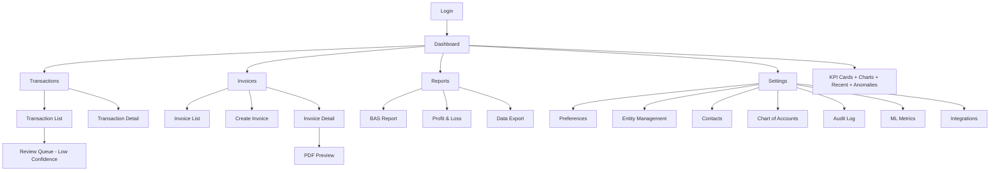

# SAYERS Finance Dashboard UI/UX Specification

<!-- Powered by BMAD™ Core -->

## Change Log

| Date | Version | Description | Author |
|------|---------|-------------|--------|
| 2025-10-03 | 1.0 | Initial frontend specification | UX Expert Agent (BMad Method) |

---

## Introduction

This document defines the user experience goals, information architecture, user flows, component specifications, and visual design system for the **SAYERS Finance Dashboard** user interface. It serves as the foundation for frontend development, ensuring a cohesive, accessible, and user-centered experience that transforms complex financial data into actionable insights.

The dashboard prioritizes clarity, efficiency, and tax compliance, enabling Harrison to manage multi-entity finances, review ML predictions, generate reports, and track invoices with minimal friction.

### Overall UX Goals & Principles

#### Target User Personas

**Primary User: Business Owner (Harrison)**
- Manages 3 entities: MOKAI PTY LTD, MOK HOUSE PTY LTD, personal finances
- Needs quick financial health overview across entities
- Reviews ML categorizations weekly (low-confidence transactions)
- Generates BAS quarterly, P&L monthly
- Creates invoices for clients (10-15/month)
- Values: Speed, accuracy, mobile access for quick checks

**Secondary User: Accountant (External)**
- Reviews financial data for tax compliance
- Exports data to accounting software (Xero/MYOB)
- Verifies GST calculations and BAS accuracy
- Occasional user (quarterly reviews)
- Values: Data accuracy, export functionality, clear audit trails

**Tertiary User: Potential Clients (Invoice Recipients)**
- Receives professional PDF invoices via email
- Views invoice details, payment instructions
- One-time interaction per invoice
- Values: Professional appearance, clear payment terms

#### Usability Goals

1. **Ease of Learning**: New users can navigate dashboard and view financial overview within 2 minutes of first login
2. **Efficiency of Use**: Power users can categorize 10 low-confidence transactions in under 3 minutes using bulk operations
3. **Error Prevention**: All financial inputs (GST calculations, date validations) prevent common mistakes with clear validation messages
4. **Memorability**: Infrequent users (accountants) can return quarterly and complete export workflows without relearning
5. **Satisfaction**: Visual design conveys professionalism and trust, reducing anxiety around financial accuracy

#### Design Principles

1. **Data First, Chrome Second** - Maximize information density while maintaining readability; minimize decorative UI
2. **Progressive Disclosure** - Show essential metrics in cards, expand to detailed views on demand; avoid overwhelming users
3. **Confidence through Clarity** - ML predictions display confidence scores prominently; ambiguity indicators (amber badges) guide review priorities
4. **Mobile Context-Aware** - Desktop = comprehensive workflows; mobile = read-only overview and quick actions (mark paid, view invoice)
5. **Accessible by Default** - WCAG AA minimum: keyboard navigation, screen reader optimized, 4.5:1 contrast ratios throughout

---

## Information Architecture

### Site Map



### Navigation Structure

**Primary Navigation (Sidebar - Desktop / Hamburger - Mobile):**
- Dashboard (Home icon) - Landing page with KPIs and overview
- Transactions (List icon) - All transactions with filtering and ML review
- Invoices (Document icon) - Invoice management and creation
- Reports (Chart icon) - Tax documents and exports
- Settings (Gear icon) - Administration and configuration

**Secondary Navigation:**
- Entity Selector (Header dropdown) - Switch between MOKAI, MOK HOUSE, Personal
- User Menu (Avatar top-right) - Profile, preferences, logout
- Notifications Bell - Anomalies, overdue invoices, low-confidence predictions

**Breadcrumb Strategy:**
- Shown on detail pages: Dashboard > Transactions > Transaction #12345
- Click any breadcrumb level to navigate up hierarchy
- Entity context displayed in breadcrumb: "MOKAI > Transactions > ..."

---

## Design System Foundations

### Color Palette

| Color Type | Hex Code | Tailwind Class | Usage |
|------------|----------|----------------|-------|
| **Primary** | `#3B82F6` | `blue-500` | Primary actions, links, active states |
| **Primary Dark** | `#1E40AF` | `blue-800` | Hover states, focused elements |
| **Success** | `#10B981` | `green-500` | Positive financial indicators (revenue, profit), high confidence (≥0.9) |
| **Success Light** | `#D1FAE5` | `green-100` | Success backgrounds |
| **Warning** | `#F59E0B` | `amber-500` | Medium confidence (0.7-0.89), caution indicators |
| **Warning Light** | `#FEF3C7` | `amber-100` | Warning backgrounds |
| **Error** | `#EF4444` | `red-500` | Negative indicators (expenses, losses, overdue), low confidence (<0.7) |
| **Error Light** | `#FEE2E2` | `red-100` | Error backgrounds |
| **Neutral 50** | `#F9FAFB` | `gray-50` | Page backgrounds |
| **Neutral 100** | `#F3F4F6` | `gray-100` | Card backgrounds |
| **Neutral 200** | `#E5E7EB` | `gray-200` | Borders, dividers |
| **Neutral 600** | `#4B5563` | `gray-600` | Secondary text |
| **Neutral 900** | `#111827` | `gray-900` | Primary text |

### Typography

**Font Families:**
- **Primary**: Inter (sans-serif) - UI text, headings, body
- **Monospace**: JetBrains Mono - Currency amounts, account codes, transaction IDs

**Type Scale:**

| Element | Size | Weight | Line Height | Usage |
|---------|------|--------|-------------|-------|
| **H1** | 2.25rem (36px) | 700 (Bold) | 1.2 | Page titles |
| **H2** | 1.875rem (30px) | 600 (Semibold) | 1.3 | Section headings |
| **H3** | 1.5rem (24px) | 600 (Semibold) | 1.4 | Card headings, subsections |
| **H4** | 1.25rem (20px) | 600 (Semibold) | 1.5 | Small headings |
| **Body** | 1rem (16px) | 400 (Regular) | 1.5 | Primary text content |
| **Body Small** | 0.875rem (14px) | 400 (Regular) | 1.5 | Secondary text, captions |
| **Body XSmall** | 0.75rem (12px) | 500 (Medium) | 1.4 | Labels, metadata |
| **Monospace Large** | 1.125rem (18px) | 600 (Semibold) | 1.4 | Currency amounts in cards |
| **Monospace** | 1rem (16px) | 500 (Medium) | 1.5 | Currency in tables |

**Currency Formatting:**
- Always use monospace font for amounts
- Include $ prefix: `$1,234.56`
- Negative amounts: `-$1,234.56` (red color)
- Positive amounts: `+$1,234.56` (green color for revenue contexts)

### Spacing System

**Grid System:** 8px base unit

| Token | Pixels | Usage |
|-------|--------|-------|
| `space-1` | 4px | Tight spacing (badges, icons) |
| `space-2` | 8px | Component padding (buttons, inputs) |
| `space-3` | 12px | Small gaps (card content) |
| `space-4` | 16px | Standard padding (cards, containers) |
| `space-6` | 24px | Section gaps (between widgets) |
| `space-8` | 32px | Large section gaps (page sections) |
| `space-12` | 48px | Extra large gaps (page layout) |

**Layout Grids:**
- **Dashboard KPI Cards**: 4 columns (desktop), 2 columns (tablet), 1 column (mobile)
- **Transaction Table**: Full width with responsive column hiding
- **Invoice List**: 3-column grid (desktop), 2-column (tablet), 1-column (mobile)

### shadcn/ui Component Library

**Core Components Used:**

**Data Display:**
- `Card` - KPI cards, widgets, containers
- `Table` - Transactions, invoices, contacts lists
- `Badge` - Status indicators, confidence scores, tags
- `Avatar` - User profile, entity icons
- `Skeleton` - Loading states

**Forms:**
- `Form` - Wrapper with React Hook Form integration
- `Input` - Text inputs, search, filters
- `Select` - Dropdowns, entity selector, category picker
- `DatePicker` - Date range filters, invoice dates
- `Combobox` - Client selection with search
- `Checkbox` - Bulk selection, filter toggles
- `Switch` - Settings toggles, active/inactive
- `Textarea` - Notes, descriptions

**Navigation:**
- `NavigationMenu` - Sidebar (desktop)
- `Tabs` - Settings sections, report types
- `Breadcrumb` - Page hierarchy
- `DropdownMenu` - User menu, action menus

**Feedback:**
- `Toast` - Success/error notifications
- `Alert` - Anomaly alerts, warnings
- `Dialog` - Modals (confirmations, forms)
- `Sheet` - Slide-out panels (mobile menu, filters)
- `Progress` - Confidence indicators, loading
- `Spinner` - Button loading states

**Charts:**
- Custom wrappers using `Card` + Recharts components
- Recharts: `LineChart`, `PieChart`, `BarChart`, `AreaChart`

---

## Core Screen Specifications

### 1. Dashboard (Home)

**Purpose:** Provide at-a-glance financial health overview with actionable insights

**User Goals:**
- Understand current financial position (revenue, expenses, profit)
- Identify trends over time
- Review recent activity and anomalies requiring attention
- Quick navigation to common tasks

**Layout Structure (Desktop 1920px):**

```
┌────────────────────────────────────────────────────────────────┐
│ Header: "Dashboard" | Entity: MOKAI PTY LTD ▼ | Date: Last 30d ▼│
├────────────────────────────────────────────────────────────────┤
│                                                                │
│ ┌─────────┬─────────┬─────────┬─────────┐                   │
│ │ Revenue │Expenses │ Profit  │Cash Flow│  (KPI Cards)       │
│ │ $12,345 │ $8,234  │ $4,111  │ $15,678 │                   │
│ │  +15%   │  +8%    │  +25%   │  -2%    │                   │
│ └─────────┴─────────┴─────────┴─────────┘                   │
│                                                                │
│ ┌──────────────────────┐ ┌──────────────────────┐           │
│ │ Revenue/Expense      │ │ Category Breakdown   │           │
│ │ Trend (Line Chart)   │ │ (Donut Chart)        │           │
│ │                      │ │                      │           │
│ │ [6-month line chart] │ │ [Pie with top 6]     │           │
│ └──────────────────────┘ └──────────────────────┘           │
│                                                                │
│ ┌──────────────────────┐ ┌──────────────────────┐           │
│ │ Recent Transactions  │ │ Anomaly Alerts (3)   │           │
│ │ (Last 10)            │ │                      │           │
│ │ - Date | Desc | Amt  │ │ ⚠ Large expense...   │           │
│ │ - 15 Jan | Office...│ │ ⚠ Rare merchant...   │           │
│ │ ...                  │ │ ⚠ Duplicate trans... │           │
│ │ [View All →]         │ │ [View All →]         │           │
│ └──────────────────────┘ └──────────────────────┘           │
└────────────────────────────────────────────────────────────────┘
```

**Component Breakdown:**

1. **Page Header**
   - `<h1>Dashboard</h1>` - Page title
   - `<Select>` - Entity switcher (MOKAI, MOK HOUSE, Personal)
   - `<Select>` - Date range selector (Last 7d, 30d, 3m, 6m, 1y, Custom)

2. **KPI Card Grid** (4 cards)
   - Component: `KPICard`
   - Props: `{ title, value, change, icon, color }`
   - Layout: CSS Grid 4 columns (desktop), 2 columns (tablet), 1 column (mobile)

3. **Trend Chart Card**
   - Component: `FinancialChart`
   - Type: Line chart (Recharts `LineChart`)
   - Data: Revenue (green), Expenses (red) by month (6 months)
   - Responsive: 100% width, 300px height (desktop), 250px (mobile)

4. **Category Breakdown Card**
   - Component: `FinancialChart`
   - Type: Donut chart (Recharts `PieChart`)
   - Data: Top 6 categories + "Other"
   - Toggle: Expenses (default) / Revenue

5. **Recent Transactions Widget**
   - Component: `TransactionWidget`
   - Shows: 10 most recent transactions
   - Columns: Date, Description, Category, Amount, Confidence badge
   - Click row → Navigate to `/transactions/[id]`

6. **Anomaly Alerts Widget**
   - Component: `AnomalyAlerts`
   - Shows: Up to 5 high-severity anomalies
   - Each alert: Description, amount, severity badge, "View Details" button
   - Empty state: Green checkmark "No anomalies detected"

**Responsive Behavior:**

**Desktop (1920px+):**
- 4 KPI cards in single row
- Charts side-by-side (50% width each)
- Widgets side-by-side (50% width each)

**Tablet (768-1919px):**
- 2 KPI cards per row (2 rows)
- Charts stacked (full width)
- Widgets stacked (full width)

**Mobile (<768px):**
- 1 KPI card per row (4 rows)
- Charts full width, 250px height
- Widgets full width
- Recent transactions: Card layout instead of table

**Accessibility:**
- Skip link to main content
- ARIA labels on charts: `aria-label="Revenue and expense trend chart"`
- Screen reader alternative: Data tables for charts (hidden visually)
- Keyboard navigation: Tab through KPI cards, charts, widgets
- Chart tooltips accessible via keyboard

**Interactive States:**

**Loading:**
- Skeleton loaders for KPI cards (shimmer animation)
- Skeleton placeholders for charts
- Skeleton rows for widgets (10 rows)

**Error:**
- KPI cards show "$--" with error icon
- Charts show "Unable to load data" message
- Widgets show error alert with retry button

**Empty:**
- KPI cards show "$0.00" with zero change
- Charts show "No data available for selected period"
- Widgets show "No recent transactions" / "No anomalies detected"

---

### 2. Transactions List

**Purpose:** Browse, filter, search, and manage all financial transactions with ML insights

**User Goals:**
- Review low-confidence ML predictions requiring manual categorization
- Search for specific transactions
- Filter by date, category, amount, confidence score
- Bulk categorize similar transactions
- Export data for accountant

**Layout Structure (Desktop):**

```
┌────────────────────────────────────────────────────────────────┐
│ Transactions | Entity: MOKAI ▼ | [+ Add Transaction]           │
├────────────────────────────────────────────────────────────────┤
│ ┌────────────────────────────────────────────────────────────┐│
│ │ Filters [Collapsible Panel]                                ││
│ │ Date Range: [Last 30d ▼] | Category: [All ▼]              ││
│ │ Confidence: [█████████░] 0.0 - 1.0                         ││
│ │ Search: [🔍 Search description, merchant...]                ││
│ │ [☐ Show only anomalies] [Clear All Filters]                ││
│ └────────────────────────────────────────────────────────────┘│
│                                                                │
│ Active Filters: [Category: Office ✕] [Confidence: <0.7 ✕]    │
│                                                                │
│ [☑ Needs Review (23)] [All (230)]  |  Showing 1-50 of 230    │
│                                                                │
│ [☐ Select All] [Categorize Selected] [Export]                 │
│                                                                │
│ ┌──────────────────────────────────────────────────────────┐ │
│ │ Date ▼ │ Description    │ Category   │ Amount  │ Conf. ▼││ │
│ │─────────┼────────────────┼────────────┼─────────┼────────┤│ │
│ │ 15 Jan  │ Office Works   │ Office Exp │ -$234.50│ 🟢 0.95││ │
│ │ 14 Jan  │ Woolworths     │ Groceries  │ -$87.23 │ 🟡 0.82││ │
│ │ 13 Jan  │ Client Payment │ Revenue    │ +$2,500 │ 🟢 0.98││ │
│ │ 12 Jan  │ Unknown Merch  │ [Uncateg.] │ -$156.78│ 🔴 0.45││ │
│ │ ...                                                        ││ │
│ └──────────────────────────────────────────────────────────┘ │
│                                                                │
│ [◀ Prev] [1] [2] [3] ... [10] [Next ▶]   [50 per page ▼]    │
└────────────────────────────────────────────────────────────────┘
```

**Component Breakdown:**

1. **Page Header**
   - `<h1>Transactions</h1>`
   - Entity selector
   - "Add Transaction" button (manual entry - future feature)

2. **Filter Panel** (Collapsible)
   - Component: `TransactionFilters`
   - Date Range: `<Select>` with presets + custom range `<DatePicker>`
   - Category: Multi-select `<Combobox>` from chart of accounts
   - Confidence Range: Custom slider component (0.0-1.0)
   - Search: `<Input>` with debounce (300ms)
   - Anomaly toggle: `<Checkbox>`
   - Clear button: Resets all filters

3. **Active Filters Badges**
   - Component: `FilterBadge`
   - Displays applied filters as removable badges
   - Click X to remove individual filter

4. **Preset Tabs**
   - "Needs Review" tab: Auto-filters confidence <0.7 or anomaly_score >0.7
   - "All" tab: Shows all transactions
   - Badge count shows number in each category

5. **Bulk Actions Toolbar**
   - Appears when ≥1 transaction selected
   - "Categorize Selected" button
   - "Export Selected" button
   - "X selected" count

6. **Transaction Table**
   - Component: `<Table>` (shadcn/ui)
   - Columns:
     - Checkbox (bulk select)
     - Date (sortable)
     - Description (clickable to detail page)
     - Category (inline editable - double-click or pencil icon)
     - Amount (monospace, color-coded)
     - Confidence (badge: 🟢 High ≥0.9, 🟡 Med 0.7-0.89, 🔴 Low <0.7)
     - Anomaly indicator (⚠ if anomaly_score >0.7)
     - Actions (View, Edit icons)
   - Row highlight: Yellow background for low-confidence (<0.7)
   - Click row → Navigate to `/transactions/[id]`

7. **Pagination Controls**
   - Component: `<Pagination>` (shadcn/ui)
   - Shows current page, total pages
   - Page size selector: 25, 50, 100 per page
   - URL query params: `?page=2&pageSize=50`

**Responsive Behavior:**

**Desktop (1920px+):**
- Full table with all columns visible
- Filter panel expanded by default

**Tablet (768-1919px):**
- Hide merchant name column
- Filter panel collapsed by default
- Table scrolls horizontally if needed

**Mobile (<768px):**
- Card-based layout instead of table
- Each transaction as expandable card:
  ```
  ┌──────────────────────────┐
  │ 15 Jan | Office Works    │
  │ -$234.50 | Office Exp    │
  │ [🟢 0.95] [⋮ Actions]     │
  └──────────────────────────┘
  ```
- Filters in slide-out `<Sheet>` panel
- Bulk actions in bottom sheet

**Accessibility:**
- Table semantics: `<table>`, `<thead>`, `<tbody>`, `<th scope="col">`
- Sortable columns: `aria-sort="ascending"`
- Confidence badges: `aria-label="High confidence: 0.95"`
- Inline editing: Focus management, ARIA live region for updates
- Keyboard shortcuts: `Ctrl+F` for search, `Ctrl+A` select all

**Interactive States:**

**Loading:**
- Skeleton table rows (10 placeholders)
- Disable filter controls, show spinner

**Empty (No Transactions):**
- Empty state illustration
- "No transactions found" message
- "Add Transaction" button (if applicable)

**Empty (No Results from Filters):**
- "No transactions match your filters" message
- "Clear Filters" button
- Show count: "0 of 230 transactions shown"

**Error:**
- Error alert at top: "Failed to load transactions"
- Retry button
- Preserve user's filters/search

---

### 3. Transaction Detail

**Purpose:** View complete transaction information, ML insights, and edit fields

**User Goals:**
- Review ML categorization reasoning
- Override incorrect category with audit trail
- Add notes and tags for future reference
- View anomaly details if flagged
- Split transaction into multiple categories
- Delete transaction (soft delete)

**Layout Structure (Desktop):**

```
┌────────────────────────────────────────────────────────────────┐
│ ← Back to Transactions | Transaction #12345                     │
├────────────────────────────────────────────────────────────────┤
│                                                                │
│ ┌─────────────────────┐ ┌─────────────────────────────────┐  │
│ │ Transaction Details │ │ ML Insights                     │  │
│ ├─────────────────────┤ ├─────────────────────────────────┤  │
│ │ Description:        │ │ AI Category: Office Supplies    │  │
│ │ [Office Works...  ] │ │ 🟢 Confidence: 0.95 [████████░] │  │
│ │                     │ │                                 │  │
│ │ Amount:             │ │ Model: categorizer-v2.1         │  │
│ │ [$234.50          ] │ │ Predicted: 2025-01-15 10:23     │  │
│ │                     │ │                                 │  │
│ │ Date:               │ │ Feature Scores:                 │  │
│ │ [15 Jan 2025      ] │ │ - Merchant similarity: 0.92     │  │
│ │                     │ │ - Amount pattern: 0.88          │  │
│ │ Category:           │ │ - Time of day: 0.76             │  │
│ │ [Office Supplies ▼] │ │                                 │  │
│ │                     │ │ [Revert to AI Category]         │  │
│ │ Notes:              │ └─────────────────────────────────┘  │
│ │ [Stationery for...] │                                      │
│ │                     │ ┌─────────────────────────────────┐  │
│ │ Tags:               │ │ Anomaly Alert                   │  │
│ │ [office] [statione] │ ├─────────────────────────────────┤  │
│ │                     │ │ ⚠ Severity: Medium (0.78)       │  │
│ │ [Save Changes]      │ │                                 │  │
│ │ [Cancel]  [Delete]  │ │ Reason: Unusually large amount  │  │
│ └─────────────────────┘ │ for this category               │  │
│                         │                                 │  │
│ ┌─────────────────────┐ │ Similar Transactions:           │  │
│ │ Metadata            │ │ - Office Works: $45.20 (avg)    │  │
│ ├─────────────────────┤ │ - This transaction: $234.50     │  │
│ │ Transaction ID:     │ │ - Difference: +419%             │  │
│ │ 12345-uuid          │ │                                 │  │
│ │                     │ │ [Mark as False Positive]        │  │
│ │ Created:            │ │ [Dismiss]                       │  │
│ │ 15 Jan 2025 10:23   │ └─────────────────────────────────┘  │
│ │                     │                                      │
│ │ Last Modified:      │                                      │
│ │ 16 Jan 2025 14:15   │                                      │
│ │ by: Harrison Sayers │                                      │
│ │                     │                                      │
│ │ Bank Account:       │                                      │
│ │ UpBank Everyday     │                                      │
│ └─────────────────────┘                                      │
└────────────────────────────────────────────────────────────────┘
```

**Component Breakdown:**

1. **Breadcrumb Navigation**
   - Component: `<Breadcrumb>`
   - Path: "Transactions > Transaction #12345"
   - Back button: Returns to transaction list preserving filters

2. **Transaction Details Form (Left Column)**
   - Component: `<Form>` (React Hook Form + Zod)
   - Fields:
     - Description: `<Input>` (max 200 chars)
     - Amount: `<Input type="number">` (2 decimal places)
     - Date: `<DatePicker>`
     - Category: `<Select>` (chart of accounts)
     - Notes: `<Textarea>` (optional)
     - Tags: Multi-select `<Combobox>` with create new
   - Validation: Real-time, inline error messages
   - Actions:
     - "Save Changes" button (primary)
     - "Cancel" button (secondary)
     - "Delete" button (destructive, confirmation dialog)

3. **ML Insights Panel (Right Column, Top)**
   - Component: `MLInsights`
   - Displays:
     - AI-predicted category (read-only badge)
     - Confidence score (progress bar + percentage)
     - Model version
     - Feature scores breakdown (collapsible list)
   - Actions:
     - "Revert to AI Category" button (if manually overridden)

4. **Anomaly Alert Card (Right Column, Conditional)**
   - Component: `AnomalyAlert`
   - Only shown if `anomaly_score > 0.5`
   - Displays:
     - Severity badge (High >0.9 red, Medium 0.7-0.9 amber)
     - Anomaly reason from ML model
     - Similar transactions comparison
     - Statistical context (average, this transaction, difference %)
   - Actions:
     - "Mark as False Positive" button
     - "Dismiss" button

5. **Metadata Panel (Left Column, Bottom)**
   - Component: `Metadata`
   - Read-only information:
     - Transaction ID (copy button)
     - Created timestamp
     - Last modified timestamp + user
     - Bank account (if synced from UpBank)

**Responsive Behavior:**

**Desktop (1920px+):**
- Two-column layout (60% left, 40% right)

**Tablet (768-1919px):**
- Stacked layout (full width)
- Details form first, then ML insights, then anomaly

**Mobile (<768px):**
- Single column
- Sticky "Save Changes" button at bottom
- Collapsible sections for ML insights and metadata

**Accessibility:**
- Form labels: `<Label>` with `htmlFor` association
- Error messages: `aria-describedby` linking to field
- Confidence progress bar: `aria-valuenow`, `aria-valuemin`, `aria-valuemax`
- Focus management: After save, announce success via ARIA live region

**Interactive States:**

**Loading:**
- Skeleton for entire page while fetching transaction data

**Editing:**
- Form fields editable
- Unsaved changes warning if user navigates away

**Saving:**
- "Save Changes" button shows spinner
- Optimistic UI update (immediate display of changes)
- Toast notification on success

**Error (Save Failed):**
- Revert optimistic changes
- Show error toast: "Failed to save changes"
- Keep form editable for retry

**Deleting:**
- Confirmation dialog: "Are you sure? This cannot be undone."
- Show spinner during delete
- Redirect to transaction list on success

---

### 4. Invoices List

**Purpose:** View, filter, and manage all invoices with status tracking

**User Goals:**
- See outstanding invoices requiring follow-up
- Filter by status (draft, sent, paid, overdue)
- Quickly mark invoices as paid
- Download invoice PDFs
- Create new invoices

**Layout Structure (Desktop):**

```
┌────────────────────────────────────────────────────────────────┐
│ Invoices | Entity: MOKAI ▼ | [+ Create Invoice]                │
├────────────────────────────────────────────────────────────────┤
│ ┌──────────┬──────────┬──────────┬──────────┐                 │
│ │Outstanding│ Overdue │Paid Month│  Drafts  │ (Summary Cards) │
│ │  $12,450  │  $1,200 │  $8,900  │    3     │                 │
│ └──────────┴──────────┴──────────┴──────────┘                 │
│                                                                │
│ Filters: [Status: All ▼] [Date Range: All ▼] [Client: All ▼] │
│                                                                │
│ ┌────────────────────────────────────────────────────────────┐│
│ │ Invoice # │ Client    │Issue Date│Due Date│Amount  │Status ││
│ │───────────┼───────────┼──────────┼────────┼────────┼───────┤│
│ │ INV-001   │ Acme Corp │ 1 Jan 25 │15 Jan  │$2,500  │🔴 Over││
│ │           │           │          │        │        │   due ││
│ │           │           │          │        │ [View PDF] [Pay]││
│ │───────────┼───────────┼──────────┼────────┼────────┼───────┤│
│ │ INV-002   │ Tech Pty  │10 Jan 25 │10 Feb  │$4,200  │🔵 Sent││
│ │           │           │          │        │ [View PDF] [Pay]││
│ │───────────┼───────────┼──────────┼────────┼────────┼───────┤│
│ │ INV-003   │ Design Co │15 Jan 25 │15 Feb  │$3,750  │🟢 Paid││
│ │           │           │          │Paid:18Jan      │        ││
│ │           │           │          │        │ [View PDF]      ││
│ │───────────┼───────────┼──────────┼────────┼────────┼───────┤│
│ │ DRAFT-001 │ New Client│--        │--      │$1,800  │⚪Draft││
│ │           │           │          │        │ [Edit] [Delete] ││
│ └────────────────────────────────────────────────────────────┘│
│                                                                │
│ [◀ Prev] [1] [2] [3] [Next ▶]   [25 per page ▼]              │
└────────────────────────────────────────────────────────────────┘
```

**Component Breakdown:**

1. **Page Header**
   - `<h1>Invoices</h1>`
   - Entity selector
   - "Create Invoice" button (primary action)

2. **Summary Cards** (4 KPIs)
   - Total Outstanding: Sum of unpaid invoices
   - Overdue: Count and amount of overdue invoices (red)
   - Paid This Month: Sum of payments received this month (green)
   - Drafts: Count of draft invoices (gray)

3. **Filter Panel**
   - Status: Multi-select (Draft, Sent, Paid, Overdue, Cancelled)
   - Date Range: Issue date or due date selector with presets
   - Client: Dropdown from contacts (searchable)

4. **Invoice Table**
   - Component: `<Table>`
   - Columns:
     - Invoice Number (link to detail page)
     - Client Name
     - Issue Date
     - Due Date (show paid date if status=paid)
     - Amount (monospace, bold)
     - Status (colored badge)
     - Actions (quick action buttons)
   - Status badges:
     - 🔴 Overdue (red)
     - 🔵 Sent (blue)
     - 🟢 Paid (green)
     - ⚪ Draft (gray)
     - 🟡 Partially Paid (amber)
   - Quick actions:
     - "View PDF" button (opens in new tab)
     - "Mark as Paid" button (sent/overdue invoices)
     - "Edit" button (draft invoices)
     - "Delete" button (draft invoices only)

5. **Pagination**
   - Component: `<Pagination>`
   - 25 per page default

**Responsive Behavior:**

**Desktop (1920px+):**
- Full table with all columns

**Tablet (768-1919px):**
- Hide issue date column
- Stack summary cards (2x2 grid)

**Mobile (<768px):**
- Card layout:
  ```
  ┌────────────────────────────┐
  │ INV-001 | 🔴 Overdue       │
  │ Acme Corp                  │
  │ Due: 15 Jan | -$2,500      │
  │ [View PDF] [Mark as Paid]  │
  └────────────────────────────┘
  ```
- Summary cards: 1 per row (4 rows)

**Accessibility:**
- Status badges: `aria-label="Status: Overdue"`
- Quick action buttons: Clear labels ("View PDF for INV-001")
- Keyboard navigation: Tab through rows and actions

**Interactive States:**

**Loading:**
- Skeleton table rows
- Skeleton summary cards

**Empty (No Invoices):**
- Empty state illustration
- "Create Your First Invoice" button
- "No invoices yet" message

**Empty (No Results):**
- "No invoices match your filters"
- "Clear Filters" button

**Marking as Paid:**
- Modal: Payment date picker, amount, method, reference
- Optimistic update (badge changes to 🟢 Paid)
- Toast: "Invoice INV-001 marked as paid"

---

### 5. Invoice Create/Edit

**Purpose:** Create professional invoices with line items, GST calculation, and client selection

**User Goals:**
- Select client (or quickly add new client)
- Add multiple line items with descriptions
- See automatic GST calculation
- Preview invoice before sending
- Save as draft or send to client

**Layout Structure (Desktop):**

```
┌────────────────────────────────────────────────────────────────┐
│ ← Back to Invoices | Create Invoice                            │
├────────────────────────────────────────────────────────────────┤
│                                                                │
│ ┌─────────────────────────────────┐ ┌────────────────────────┐│
│ │ Invoice Details                 │ │ Totals                 ││
│ ├─────────────────────────────────┤ ├────────────────────────┤│
│ │ Client: *                       │ │ Subtotal:    $3,000.00 ││
│ │ [Search clients...          ▼]  │ │                        ││
│ │ [+ Add New Client]              │ │ GST (10%):     $300.00 ││
│ │                                 │ │                        ││
│ │ Invoice Number:                 │ │ Total Due: $3,300.00   ││
│ │ [INV-004                     ]  │ │                        ││
│ │ (Auto-generated)                │ │                        ││
│ │                                 │ └────────────────────────┘│
│ │ Issue Date: *                   │                            │
│ │ [15 Jan 2025                 ]  │ ┌────────────────────────┐│
│ │                                 │ │ Preview                ││
│ │ Due Date: *                     │ ├────────────────────────┤│
│ │ [14 Feb 2025                 ]  │ │ [Invoice PDF preview]  ││
│ │                                 │ │                        ││
│ │ Payment Terms:                  │ │ [Toggle Preview]       ││
│ │ [Net 30                      ▼] │ └────────────────────────┘│
│ └─────────────────────────────────┘                            │
│                                                                │
│ Line Items: *                                                  │
│ ┌────────────────────────────────────────────────────────────┐│
│ │ Description   │ Qty │ Unit Price │ GST │ Amount            ││
│ │───────────────┼─────┼────────────┼─────┼───────────────────┤│
│ │ [Web Design..│ [1] │ [$1,500.00]│ [✓] │ $1,500.00   [✕]   ││
│ │ [Development.│ [40]│ [$75.00   ]│ [✓] │ $3,000.00   [✕]   ││
│ │ [+ Add Line Item]                                          ││
│ └────────────────────────────────────────────────────────────┘│
│                                                                │
│ Notes (Optional):                                              │
│ [Thank you for your business...]                               │
│                                                                │
│ [Save as Draft] [Save & Send] [Cancel]                        │
└────────────────────────────────────────────────────────────────┘
```

**Component Breakdown:**

1. **Breadcrumb Navigation**
   - "Invoices > Create Invoice" (or "Invoices > Edit INV-001")

2. **Invoice Details Form (Left Column)**
   - Client selector: `<Combobox>` with search
     - Searches contacts by name
     - "+ Add New Client" option opens quick-add modal
   - Invoice number: `<Input>` (auto-generated, editable)
   - Issue date: `<DatePicker>` (default: today)
   - Due date: `<DatePicker>` (default: +30 days from issue)
   - Payment terms: `<Select>` (Net 7, Net 14, Net 30, Net 60)

3. **Line Items Table**
   - Component: `<Table>` with dynamic rows (React Hook Form `useFieldArray`)
   - Columns:
     - Description: `<Input>` (text)
     - Quantity: `<Input type="number">` (default: 1)
     - Unit Price: `<Input type="number">` (currency)
     - GST: `<Checkbox>` (default: checked)
     - Amount: Calculated field (qty * price, read-only, monospace)
     - Delete: Icon button to remove row
   - "+ Add Line Item" button: Appends new row
   - Minimum: 1 line item required

4. **Totals Sidebar (Right Column, Top)**
   - Component: `InvoiceTotals`
   - Real-time calculations:
     - Subtotal: Sum of line item amounts (excluding GST)
     - GST: 10% of GST-applicable items
     - Total Due: Subtotal + GST (large, bold)
   - Updates live as line items change

5. **Preview Panel (Right Column, Bottom - Optional)**
   - Component: `InvoicePreview`
   - Shows PDF preview using same layout as generated PDF
   - Toggle button to show/hide preview
   - Helps users verify formatting before sending

6. **Notes Field**
   - `<Textarea>` for additional notes (optional)
   - Placeholder: "Payment terms, thank you message..."

7. **Action Buttons**
   - "Save as Draft": Saves with status='draft', redirects to list
   - "Save & Send": Generates PDF, saves with status='sent', shows success modal
   - "Cancel": Returns to invoice list (confirmation if unsaved changes)

**Quick Add Client Modal:**

```
┌────────────────────────────────┐
│ Add New Client                 │
├────────────────────────────────┤
│ Name: *                        │
│ [Acme Corporation            ] │
│                                │
│ Email:                         │
│ [contact@acme.com            ] │
│                                │
│ ABN:                           │
│ [12 345 678 901              ] │
│                                │
│ [Cancel] [Save & Select]       │
└────────────────────────────────┘
```

**Responsive Behavior:**

**Desktop (1920px+):**
- Two-column layout (60% form, 40% totals + preview)

**Tablet (768-1919px):**
- Stacked layout (full width)
- Totals sidebar moves to right of line items table

**Mobile (<768px):**
- Single column
- Line items: Simplified mobile form (one item per screen)
- Totals: Sticky card at bottom
- Preview: Separate tab/page

**Accessibility:**
- Form validation: Inline errors with `aria-invalid`, `aria-describedby`
- Line item table: Proper `<table>` semantics
- Dynamic rows: Announce additions/removals via ARIA live region
- Totals: `aria-live="polite"` for real-time updates

**Interactive States:**

**Loading (Edit Mode):**
- Skeleton form while fetching invoice data

**Editing Line Items:**
- Real-time calculation as user types
- Debounce (300ms) to prevent excessive re-renders

**Validation Errors:**
- Client required: Red border, "Please select a client"
- At least 1 line item: "Add at least one line item"
- All line item fields required: Inline red borders

**Saving as Draft:**
- "Save as Draft" button shows spinner
- Toast: "Invoice saved as draft"
- Redirect to invoice list

**Saving & Sending:**
- Generate PDF (takes 2-5 seconds)
- Show progress modal: "Generating invoice PDF..."
- Success modal: PDF preview, "Send to client" button (future: email integration)
- Toast: "Invoice sent to [client]"

**Quick Add Client Success:**
- Modal closes
- New client auto-selected in dropdown
- Green checkmark animation
- Focus returns to invoice form

---

### 6. Reports (BAS & Income Statement)

**Purpose:** Generate tax compliance documents with preview and export

**User Goals:**
- Calculate BAS for quarterly submission to ATO
- Generate Profit & Loss statement for business review
- Export data for accountant in CSV/PDF format
- Verify calculations before submission

**Layout Structure (BAS Report - Desktop):**

```
┌────────────────────────────────────────────────────────────────┐
│ Reports > BAS Report                                           │
├────────────────────────────────────────────────────────────────┤
│                                                                │
│ ┌────────────────────────────────────────────────────────────┐│
│ │ Report Settings                                            ││
│ │ Quarter: [Q2 (Oct-Dec) ▼] | Year: [2025 ▼] | Entity: MOKAI││
│ │ [Generate Report]                                          ││
│ └────────────────────────────────────────────────────────────┘│
│                                                                │
│ ┌──────────────────────┐ ┌──────────────────────────────────┐│
│ │ Report Preview       │ │ GST Summary                      ││
│ ├──────────────────────┤ ├──────────────────────────────────┤│
│ │ [Watermark: PREVIEW] │ │ GST on Sales (1A):   $1,250.00   ││
│ │                      │ │                                  ││
│ │ Business Activity    │ │ GST on Purchases (1B): $780.00   ││
│ │ Statement (BAS)      │ │                                  ││
│ │                      │ │ Net Amount (7):       $470.00    ││
│ │ For Quarter Ending:  │ │ 🟢 Refund Due                    ││
│ │ 31 December 2025     │ └──────────────────────────────────┘│
│ │                      │                                      │
│ │ Entity: MOKAI PTY LTD│ ┌──────────────────────────────────┐│
│ │ ABN: 12 345 678 901  │ │ Export Options                   ││
│ │                      │ ├──────────────────────────────────┤│
│ │ G1 Total Sales:      │ │ [Download PDF]                   ││
│ │     $12,500.00 [ℹ]   │ │ [Download CSV]                   ││
│ │                      │ │ [Email to Accountant]            ││
│ │ 1A GST on Sales:     │ └──────────────────────────────────┘│
│ │     $1,250.00  [ℹ]   │                                      │
│ │                      │ ┌──────────────────────────────────┐│
│ │ G10 Capital Purch:   │ │ Validation Warnings              ││
│ │     $0.00      [ℹ]   │ ├──────────────────────────────────┤│
│ │                      │ │ ⚠ G1: 5 transactions flagged as  ││
│ │ G11 Non-Capital:     │ │   anomalies. Review before submit││
│ │     $7,800.00  [ℹ]   │ │                                  ││
│ │                      │ │ ✓ All GST calculations verified  ││
│ │ 1B GST on Purchases: │ └──────────────────────────────────┘│
│ │     $780.00    [ℹ]   │                                      │
│ │                      │                                      │
│ │ ...                  │                                      │
│ │                      │                                      │
│ │ [View Supporting     │                                      │
│ │  Transactions]       │                                      │
│ └──────────────────────┘                                      │
└────────────────────────────────────────────────────────────────┘
```

**Component Breakdown:**

1. **Report Settings Panel**
   - Quarter selector: `<Select>` (Q1-Q4 with month ranges)
   - Year selector: `<Select>` (last 5 years)
   - Entity selector: `<Select>` (if multi-entity)
   - "Generate Report" button: Triggers calculation service

2. **Report Preview Pane (Left Column)**
   - Component: `BASPreview`
   - Shows BAS form in ATO-compliant format
   - Watermark: "PREVIEW ONLY - NOT FOR SUBMISSION"
   - Fields with info icons (ℹ): Tooltip shows what transactions contributed
   - "View Supporting Transactions" expandable sections

3. **GST Summary Card (Right Column, Top)**
   - Component: `GSTSummary`
   - Displays:
     - GST on Sales (1A): Total GST collected
     - GST on Purchases (1B): Total GST paid
     - Net Amount (7): Difference (color-coded)
   - Net amount:
     - 🟢 Green if refund due (negative)
     - 🔴 Red if payment owed (positive)

4. **Export Options Card**
   - Download PDF: Generates ATO-ready PDF
   - Download CSV: Machine-readable format for accounting software
   - Email to Accountant: Pre-fills email with PDF attached (future)

5. **Validation Warnings Card**
   - Shows any data quality issues:
     - Transactions with anomalies
     - Missing GST information
     - Manual adjustments applied
   - Color-coded:
     - ⚠ Amber: Review recommended
     - ✓ Green: Validation passed

**Income Statement (P&L) Layout:**

```
┌────────────────────────────────────────────────────────────────┐
│ Reports > Income Statement (Profit & Loss)                     │
├────────────────────────────────────────────────────────────────┤
│ Period: [Last Month ▼] | Entity: MOKAI | Compare: [☐ Prior]   │
│ [Generate Report]                                              │
│                                                                │
│ ┌──────────────────────┐ ┌──────────────────────────────────┐│
│ │ Income Statement     │ │ Category Breakdown               ││
│ │ January 2025         │ │ [Bar Chart: Top 5 Revenue/Exp]   ││
│ ├──────────────────────┤ └──────────────────────────────────┘│
│ │ REVENUE:             │                                      │
│ │ Sales Revenue        │ ┌──────────────────────────────────┐│
│ │   $12,500.00         │ │ Export Options                   ││
│ │ Other Income         │ │ [Download PDF]                   ││
│ │   $500.00            │ │ [Download Excel]                 ││
│ │ ──────────────       │ │ [Download CSV]                   ││
│ │ Total Revenue:       │ └──────────────────────────────────┘│
│ │   $13,000.00         │                                      │
│ │                      │                                      │
│ │ EXPENSES:            │                                      │
│ │ Office Expenses      │                                      │
│ │   $1,200.00          │                                      │
│ │ Marketing            │                                      │
│ │   $800.00            │                                      │
│ │ Software             │                                      │
│ │   $450.00            │                                      │
│ │ ──────────────       │                                      │
│ │ Total Expenses:      │                                      │
│ │   $2,450.00          │                                      │
│ │                      │                                      │
│ │ NET PROFIT:          │                                      │
│ │ 🟢 $10,550.00        │                                      │
│ └──────────────────────┘                                      │
└────────────────────────────────────────────────────────────────┘
```

**Responsive Behavior:**

**Desktop (1920px+):**
- Side-by-side layout (preview + summary/export)

**Tablet (768-1919px):**
- Stacked layout
- Preview full width, summary/export below

**Mobile (<768px):**
- Single column
- Preview: Simplified mobile view (key figures only)
- Charts: Smaller, portrait orientation

**Accessibility:**
- Report preview: Semantic HTML (`<table>` for BAS fields)
- Export buttons: Clear labels ("Download BAS PDF for Q2 2025")
- Validation warnings: ARIA live region for alerts

**Interactive States:**

**Loading (Generating Report):**
- Show spinner: "Calculating BAS for Q2 2025..."
- Disable export buttons

**Preview Generated:**
- Smooth transition from loading to preview
- Scroll to top of preview pane

**Export PDF:**
- Show spinner: "Generating PDF..."
- Download triggers automatically
- Toast: "BAS PDF downloaded"

**Validation Warnings:**
- Expand/collapse sections
- Click warning to view related transactions

---

### 7. Settings

**Purpose:** Manage user preferences, entities, contacts, accounts, and view audit logs

**User Goals:**
- Configure default entity and date formats
- Manage business entities (MOKAI, MOK HOUSE, personal)
- Add/edit customers and suppliers
- Configure chart of accounts
- View audit trail for compliance
- Monitor ML model performance

**Layout Structure (Tabbed Interface - Desktop):**

```
┌────────────────────────────────────────────────────────────────┐
│ Settings                                                       │
├────────────────────────────────────────────────────────────────┤
│ [Preferences] [Entities] [Contacts] [Accounts] [Audit] [ML]   │
├────────────────────────────────────────────────────────────────┤
│                                                                │
│ (Tab content loads here based on selection)                    │
│                                                                │
└────────────────────────────────────────────────────────────────┘
```

**Tab 1: Preferences**

```
┌────────────────────────────────────────────────────────────────┐
│ User Preferences                                               │
├────────────────────────────────────────────────────────────────┤
│                                                                │
│ General Settings:                                              │
│ Default Entity: [MOKAI PTY LTD           ▼]                    │
│ Language:       [English (Australia)     ▼]                    │
│ Timezone:       [Australia/Sydney        ▼]                    │
│                                                                │
│ Display Settings:                                              │
│ Date Format:    [DD/MM/YYYY              ▼]                    │
│   Example: 15/01/2025                                          │
│                                                                │
│ Currency Format:[AUD $X,XXX.XX           ▼]                    │
│   Example: AUD $1,234.56                                       │
│                                                                │
│ Dashboard Layout:                                              │
│ [☑] Show Recent Transactions                                   │
│ [☑] Show Anomaly Alerts                                        │
│ [☑] Show Charts                                                │
│                                                                │
│ Notifications:                                                 │
│ Email Notifications:                                           │
│ [☑] New Anomalies Detected                                     │
│ [☑] Invoices Overdue                                           │
│ [☑] Low Confidence Predictions (< 0.7)                         │
│                                                                │
│ [Save Preferences] [Reset to Defaults]                         │
└────────────────────────────────────────────────────────────────┘
```

**Tab 2: Entities**

```
┌────────────────────────────────────────────────────────────────┐
│ Entity Management                                              │
├────────────────────────────────────────────────────────────────┤
│ [+ Add Entity]                                                 │
│                                                                │
│ ┌──────────────────────────────────────────────────────────┐  │
│ │ MOKAI PTY LTD                                     [Edit]  │  │
│ │ ABN: 12 345 678 901 | Type: Company | ✓ Active          │  │
│ │ Sydney, NSW 2000                                         │  │
│ └──────────────────────────────────────────────────────────┘  │
│                                                                │
│ ┌──────────────────────────────────────────────────────────┐  │
│ │ MOK HOUSE PTY LTD                                 [Edit]  │  │
│ │ ABN: 98 765 432 109 | Type: Company | ✓ Active          │  │
│ │ Sydney, NSW 2000                                         │  │
│ └──────────────────────────────────────────────────────────┘  │
│                                                                │
│ ┌──────────────────────────────────────────────────────────┐  │
│ │ Harrison Robert Sayers                            [Edit]  │  │
│ │ Type: Sole Trader | ✓ Active                            │  │
│ │ Sydney, NSW 2000                                         │  │
│ └──────────────────────────────────────────────────────────┘  │
└────────────────────────────────────────────────────────────────┘
```

**Tab 3: Contacts**

```
┌────────────────────────────────────────────────────────────────┐
│ Contacts                                                       │
├────────────────────────────────────────────────────────────────┤
│ [+ Add Contact] | Search: [🔍 Search name, ABN...]            │
│ Filter: [All Types ▼] [Active ▼]                              │
│                                                                │
│ ┌────────────────────────────────────────────────────────────┐│
│ │ Name        │ Type     │ Email           │ Phone  │ Actions││
│ │─────────────┼──────────┼─────────────────┼────────┼────────┤│
│ │ Acme Corp   │ Customer │ hi@acme.com     │ 0400...│ [Edit] ││
│ │ Tech Pty    │ Both     │ info@tech.com   │ 0400...│ [Edit] ││
│ │ Supplier Co │ Supplier │ sales@supp.com  │ 0400...│ [Edit] ││
│ └────────────────────────────────────────────────────────────┘│
│                                                                │
│ [Export Contacts CSV]                                          │
└────────────────────────────────────────────────────────────────┘
```

**Tab 4: Chart of Accounts**

```
┌────────────────────────────────────────────────────────────────┐
│ Chart of Accounts                                              │
├────────────────────────────────────────────────────────────────┤
│ [+ Add Account] | Filter: [All Types ▼] [Active ▼]            │
│                                                                │
│ ┌────────────────────────────────────────────────────────────┐│
│ │ Code │ Name            │ Type    │ Tax Treatment │ Actions ││
│ │──────┼─────────────────┼─────────┼───────────────┼─────────┤│
│ │ 4000 │ Sales Revenue   │ Revenue │ GST on Income │ [Edit]  ││
│ │ 5100 │ Office Expenses │ Expense │ GST on Exp.   │ [Edit]  ││
│ │ 5200 │ Marketing       │ Expense │ GST on Exp.   │ [Edit]  ││
│ │ 5300 │ Software        │ Expense │ GST on Exp.   │ [Edit]  ││
│ └────────────────────────────────────────────────────────────┘│
│                                                                │
│ [Export Chart CSV]                                             │
└────────────────────────────────────────────────────────────────┘
```

**Tab 5: Audit Log**

```
┌────────────────────────────────────────────────────────────────┐
│ Audit Log                                                      │
├────────────────────────────────────────────────────────────────┤
│ Filter: [Date Range ▼] [User ▼] [Action ▼] [Object Type ▼]   │
│ Search: [🔍 Search changes...]                                 │
│                                                                │
│ ┌────────────────────────────────────────────────────────────┐│
│ │ Time     │ User  │ Action │ Object   │ Changes             ││
│ │──────────┼───────┼────────┼──────────┼─────────────────────┤│
│ │15Jan 14:23│Harry │Updated │Trans #123│Category: Office → ││
│ │          │       │        │          │Groceries            ││
│ │15Jan 10:15│Harry │Created │Invoice   │INV-004 for $3,300   ││
│ │14Jan 16:45│Harry │Deleted │Trans #122│Amount: -$45.00      ││
│ └────────────────────────────────────────────────────────────┘│
│                                                                │
│ [Export Audit Log CSV]                                         │
└────────────────────────────────────────────────────────────────┘
```

**Tab 6: ML Metrics**

```
┌────────────────────────────────────────────────────────────────┐
│ ML Model Performance                                           │
├────────────────────────────────────────────────────────────────┤
│                                                                │
│ ┌──────────┬──────────┬──────────┬──────────┐                 │
│ │Total Pred│Avg Conf. │Accuracy  │Anomalies │                 │
│ │  1,234   │  0.87    │  92.5%   │   45     │                 │
│ └──────────┴──────────┴──────────┴──────────┘                 │
│                                                                │
│ ┌──────────────────────┐ ┌──────────────────────────────────┐│
│ │ Confidence Distrib.  │ │ Category Accuracy                ││
│ │ [Histogram Chart]    │ │ [Bar Chart: Top 10 Categories]   ││
│ └──────────────────────┘ └──────────────────────────────────┘│
│                                                                │
│ Active Models:                                                 │
│ - transaction-categorizer-v2.1 (Deployed: 1 Jan 2025)         │
│ - anomaly-detector-v1.3 (Deployed: 15 Dec 2024)               │
│                                                                │
│ [Refresh Metrics]                                              │
└────────────────────────────────────────────────────────────────┘
```

**Responsive Behavior:**

**Desktop (1920px+):**
- Horizontal tabs

**Tablet (768-1919px):**
- Horizontal tabs (scrollable if needed)
- Tables: Horizontal scroll

**Mobile (<768px):**
- Vertical tabs (stacked navigation)
- Card layouts instead of tables

**Accessibility:**
- Tabs: `role="tablist"`, `role="tab"`, `aria-selected`
- Forms: Proper labels, validation messages
- Tables: Semantic HTML with headers

---

## Custom Components Specifications

### KPICard Component

```typescript
interface KPICardProps {
  title: string;
  value: string; // Pre-formatted currency or number
  change?: {
    value: number; // Percentage change
    period: string; // "vs last month"
  };
  icon?: React.ReactNode;
  color?: 'success' | 'error' | 'neutral';
  loading?: boolean;
}
```

**Visual Spec:**
- Card with subtle shadow, 1px border
- Icon top-left (24x24px)
- Title: gray-600, 14px
- Value: Large (24px), bold, monospace
- Change indicator: Badge with ↑/↓ arrow, colored by sign
- Loading: Skeleton with shimmer animation

**States:**
- Default: White background
- Loading: Gray skeleton
- Error: Red border, "$--" value

### FinancialChart Component

```typescript
interface FinancialChartProps {
  type: 'line' | 'bar' | 'pie' | 'donut';
  data: Array<{
    label: string;
    value: number;
    color?: string;
  }>;
  title?: string;
  height?: number; // Default: 300px
  loading?: boolean;
  emptyMessage?: string;
}
```

**Visual Spec:**
- Recharts ResponsiveContainer (100% width)
- Tooltip: White background, shadow, formatted values
- Legend: Below chart (desktop), hidden (mobile if space-constrained)
- Colors: Use design system palette (blue, green, red, amber)

**Accessibility:**
- Data table alternative (hidden visually, screen reader only)
- `aria-label` with chart description
- Keyboard navigation for tooltips (if supported)

### TransactionRow Component

```typescript
interface TransactionRowProps {
  transaction: {
    id: string;
    date: string;
    description: string;
    amount_cents: number;
    ai_category: string | null;
    ai_confidence: number | null;
    anomaly_score: number | null;
  };
  onCategorize: (id: string, category: string) => void;
  onEdit: (id: string) => void;
  selected?: boolean;
  onSelect?: (id: string, selected: boolean) => void;
}
```

**Visual Spec:**
- Table row with hover state (gray-50 background)
- Checkbox for bulk selection
- Clickable row navigates to detail
- Inline editable category (double-click or pencil icon)
- Yellow background if confidence <0.7

**Interactions:**
- Click row → Navigate to `/transactions/[id]`
- Double-click category → Inline edit mode
- Checkbox → Add/remove from selection

### MLConfidenceIndicator Component

```typescript
interface MLConfidenceIndicatorProps {
  confidence: number; // 0.0-1.0
  category?: string;
  size?: 'sm' | 'md' | 'lg';
}
```

**Visual Spec:**
- Badge component with:
  - 🟢 Green: ≥0.9 "High"
  - 🟡 Amber: 0.7-0.89 "Medium"
  - 🔴 Red: <0.7 "Low"
- Shows percentage: "0.95" or "95%"
- Tooltip: "High confidence: 0.95"

**Accessibility:**
- `aria-label="High confidence: 0.95"`
- Color + text (not color alone)

### InvoiceLineItem Component

```typescript
interface InvoiceLineItemProps {
  item: {
    id: string;
    description: string;
    quantity: number;
    unit_price_cents: number;
    gst_applicable: boolean;
  };
  onEdit: (id: string, updates: Partial<InvoiceLineItem>) => void;
  onDelete: (id: string) => void;
  errors?: Record<string, string>;
}
```

**Visual Spec:**
- Table row with inline editable fields
- Delete icon button (trash icon, red on hover)
- Real-time validation (red border on error)
- Amount calculated automatically (read-only, monospace)

**Interactions:**
- Edit any field → Blur triggers validation
- Quantity/price change → Re-calculate amount
- Delete button → Remove row (confirmation if saved invoice)

### EntitySwitcher Component

```typescript
interface EntitySwitcherProps {
  entities: Array<{
    id: string;
    name: string;
    entity_type: string;
  }>;
  currentEntity: string; // Entity ID
  onChange: (entityId: string) => void;
}
```

**Visual Spec:**
- Dropdown (Select component) in header
- Shows entity name + type badge
- Active entity: Blue background in dropdown
- Icon: Building icon for companies, User icon for sole trader

**Interactions:**
- Click → Open dropdown
- Select entity → Trigger full page refresh with new entity context
- URL updates: `?entity=mokai-pty-ltd`

### AnomalyAlert Component

```typescript
interface AnomalyAlertProps {
  anomaly: {
    transaction_id: string;
    severity: 'high' | 'medium';
    reason: string;
    amount_cents: number;
  };
  onReview: (transactionId: string) => void;
  onDismiss: (transactionId: string) => void;
}
```

**Visual Spec:**
- Alert card (shadcn/ui Alert component)
- Severity icon: ⚠ red (high), ⚠ amber (medium)
- Title: Transaction description
- Body: Anomaly reason
- Actions: "Review" button (primary), "Dismiss" button (secondary)

**Interactions:**
- Review → Navigate to transaction detail with anomaly section highlighted
- Dismiss → Mark as reviewed, remove from alerts list

---

## Interaction Patterns

### Transaction Categorization Flow

**Scenario:** User reviews ML prediction and corrects category

1. **Entry:** User navigates to Transactions page
2. **Filter:** Clicks "Needs Review (23)" tab → Auto-filters confidence <0.7
3. **Select:** Sees yellow-highlighted row "Unknown Merchant | $156.78 | 🔴 0.45"
4. **Review:** Double-clicks category cell → Dropdown opens with chart of accounts
5. **Categorize:** Selects "Office Supplies" from dropdown
6. **Save:** Immediately on selection:
   - Optimistic UI: Cell updates to "Office Supplies"
   - Background: POST to API with old/new category, logs to audit trail
   - Toast: "Category updated"
7. **Refresh:** Confidence badge changes to "Manual" (no color), row background returns to white
8. **Next:** User tabs to next low-confidence transaction

**Optimistic UI:**
- Category updates immediately (before server response)
- If server fails, revert change + show error toast

**Keyboard Navigation:**
- Tab through rows
- Enter on row → Navigate to detail
- Double-click category → Edit mode
- Escape → Cancel edit

### Invoice Creation Flow

**Scenario:** User creates invoice for client

1. **Entry:** User clicks "Create Invoice" button in Invoices page
2. **Client Selection:**
   - User types "Acme" in client combobox
   - Dropdown filters: "Acme Corporation" appears
   - User selects "Acme Corporation"
3. **Client Not Found:**
   - User types "New Client" (no match)
   - User clicks "+ Add New Client" option
   - Modal opens: Quick-add form (name, email, ABN)
   - User fills "New Client Inc.", "contact@newclient.com"
   - Clicks "Save & Select"
   - Modal closes, "New Client Inc." auto-selected
4. **Line Items:**
   - Default: 1 empty line item row
   - User enters: "Web Design Services" | Qty: 1 | Price: $1,500 | GST: ✓
   - Clicks "+ Add Line Item"
   - New row appears
   - User enters: "Development" | Qty: 40 | Price: $75 | GST: ✓
5. **Totals Update:**
   - Real-time calculation as user types
   - Subtotal: $4,500
   - GST: $450
   - Total: $4,950
6. **Dates:**
   - Issue date: Auto-filled (today)
   - Due date: Auto-filled (+30 days)
   - User adjusts due date to +14 days
7. **Save:**
   - User clicks "Save & Send"
   - Modal: "Generating PDF..."
   - PDF generates (3 seconds)
   - Success modal: PDF preview + "Invoice sent" message
   - Redirect to invoice list
   - Toast: "Invoice INV-005 sent to New Client Inc."

**Validation:**
- Client required: Red border if empty on blur
- At least 1 line item: Disabled "Save" button if none
- All line fields required: Inline validation on blur

### Multi-Entity Switching

**Scenario:** User switches from MOKAI to MOK HOUSE

1. **Entry:** User viewing MOKAI dashboard
2. **Switch:**
   - User clicks entity dropdown in header
   - Sees: "MOKAI PTY LTD ✓" (active), "MOK HOUSE PTY LTD", "Harrison Sayers"
   - User clicks "MOK HOUSE PTY LTD"
3. **Refresh:**
   - Full page refresh (all data refetches)
   - URL updates: `?entity=mok-house-pty-ltd`
   - Dashboard KPIs, charts, widgets update to MOK HOUSE data
   - Entity dropdown shows "MOK HOUSE PTY LTD ✓"
4. **Persistence:**
   - Selection saved to localStorage
   - On next visit, MOK HOUSE remains selected
5. **Navigation:**
   - User navigates to Transactions → Still shows MOK HOUSE transactions
   - Entity context persists across all pages

**RLS Enforcement:**
- All Supabase queries include `entity_id = current_entity`
- RLS policies ensure no data leakage

---

## Responsive Design Patterns

### Breakpoints

| Breakpoint | Min Width | Max Width | Layout Strategy |
|------------|-----------|-----------|-----------------|
| **Mobile** | 320px | 767px | Single column, cards, bottom nav |
| **Tablet** | 768px | 1279px | 2 columns, collapsible sidebar |
| **Desktop** | 1280px | 1919px | 3 columns, full sidebar |
| **Wide** | 1920px+ | - | Expanded layout, more whitespace |

### Layout Transformations

**Dashboard:**
- Desktop: 4 KPI cards in 1 row, 2 charts side-by-side
- Tablet: 2 KPI cards per row, 2 charts stacked
- Mobile: 1 KPI card per row, 1 chart per row

**Transactions Table:**
- Desktop: Full table with all columns
- Tablet: Hide merchant column, horizontal scroll
- Mobile: Card layout (no table), expandable rows

**Invoice List:**
- Desktop: Full table
- Tablet: Hide issue date column
- Mobile: Card layout with key info

**Forms:**
- Desktop: Multi-column (invoice line items in table)
- Tablet: Single column with wider inputs
- Mobile: Single column, stacked fields

### Mobile-Specific Considerations

**Touch Targets:**
- Minimum 44x44px (Apple HIG)
- Spacing between buttons: 8px minimum

**Navigation:**
- Bottom nav bar: Dashboard, Transactions, Invoices, Reports, More
- Hamburger menu for secondary nav (Settings, etc.)

**Forms:**
- Large input fields (16px font minimum)
- Numeric keyboard for currency inputs
- Native date pickers on mobile devices

**Charts:**
- Smaller height (250px vs 300px)
- Simplified tooltips (single line)
- Legend below chart (not right)

**Gestures:**
- Swipe to delete (invoice list)
- Pull to refresh (transaction list)
- Swipe between tabs (reports)

---

## Accessibility Requirements (WCAG AA)

### Color Contrast

- **Text on background**: 4.5:1 minimum
  - Gray-900 on white: 16.9:1 ✓
  - Blue-500 on white: 4.5:1 ✓
- **UI components**: 3:1 minimum
  - Borders, buttons, badges: All tested

### Keyboard Navigation

**Focus Management:**
- Visible focus indicators: 2px blue-500 outline
- Skip to main content link (top of page)
- Tab order: Logical (left-to-right, top-to-bottom)

**Keyboard Shortcuts:**
- `Tab`: Next focusable element
- `Shift+Tab`: Previous element
- `Enter`: Activate button/link
- `Space`: Toggle checkbox
- `Escape`: Close modal/dropdown
- `Ctrl+F`: Focus search input

### Screen Reader Support

**ARIA Labels:**
- Charts: `aria-label="Revenue and expense trend chart for last 6 months"`
- Buttons: `aria-label="Mark invoice INV-001 as paid"`
- Form fields: `<label htmlFor="invoice-client">` + `<input id="invoice-client">`

**Live Regions:**
- Toast notifications: `aria-live="polite"`
- Real-time calculations: `aria-live="polite"` (totals sidebar)
- Loading states: `aria-busy="true"`

**Semantic HTML:**
- `<table>`, `<thead>`, `<tbody>` for data tables
- `<nav>` for navigation menus
- `<main>` for main content area
- `<aside>` for sidebars
- `<h1>`-`<h6>` heading hierarchy

### Alternative Text

**Charts:**
- Visual representation + data table (hidden, screen reader only)
- Example:
  ```html
  <div aria-label="Revenue and expense trend chart">
    <Recharts.LineChart>...</Recharts.LineChart>
  </div>
  <table className="sr-only">
    <caption>Revenue and expense data</caption>
    <!-- Data table rows -->
  </table>
  ```

**Icons:**
- Decorative icons: `aria-hidden="true"`
- Functional icons: `aria-label` describing action

### Form Validation

**Error Messages:**
- Associated with field: `aria-describedby="email-error"`
- Clear, specific: "Email must be valid format"
- Visible and screen reader accessible

**Required Fields:**
- `aria-required="true"`
- Visual asterisk (*) + label text

---

## Performance Considerations

### Loading Strategies

**Initial Page Load:**
- Server-side render dashboard KPIs (React Server Components)
- Client-side hydrate charts (Recharts loaded dynamically)
- Skeleton loaders for widgets (immediate visual feedback)

**Lazy Loading:**
- Charts: Dynamic import `const Chart = dynamic(() => import('recharts'))`
- PDF preview: Load only when user clicks "Preview" button
- Invoice PDF generation: Server-side, on-demand

**Data Prefetching:**
- Prefetch transaction detail on row hover (Next.js Link)
- Prefetch dashboard data on login

### Optimization Techniques

**Virtual Scrolling:**
- Transaction lists >100 rows: Use `react-window` or `react-virtualized`
- Only render visible rows + buffer

**Memoization:**
- Chart data transformations: `useMemo`
- Expensive calculations (BAS totals): `useMemo`
- Component rendering: `React.memo` for pure components

**Debouncing:**
- Search inputs: 300ms debounce
- Real-time calculations: 200ms debounce

**Bundle Optimization:**
- Tree-shaking: Import only used components from shadcn/ui
- Code splitting: Route-based (Next.js automatic)
- Minimize third-party libraries

### Performance Goals

- **First Contentful Paint (FCP)**: <1.5s
- **Largest Contentful Paint (LCP)**: <2.5s
- **Time to Interactive (TTI)**: <3.5s
- **Cumulative Layout Shift (CLS)**: <0.1

**Monitoring:**
- Vercel Analytics for Core Web Vitals
- Sentry for error tracking

---

## Component Inventory

### shadcn/ui Components Needed

**Data Display:**
- ✓ Card
- ✓ Table
- ✓ Badge
- ✓ Avatar
- ✓ Skeleton

**Forms:**
- ✓ Form
- ✓ Input
- ✓ Select
- ✓ DatePicker
- ✓ Combobox
- ✓ Checkbox
- ✓ Switch
- ✓ Textarea
- ✓ Label

**Navigation:**
- ✓ NavigationMenu
- ✓ Tabs
- ✓ Breadcrumb
- ✓ DropdownMenu

**Feedback:**
- ✓ Toast
- ✓ Alert
- ✓ Dialog
- ✓ Sheet
- ✓ Progress
- ✓ Spinner (custom)

### Custom Components to Build

1. **KPICard** - Metric display with change indicator
2. **FinancialChart** - Recharts wrapper with accessibility
3. **TransactionRow** - Table row with inline editing
4. **TransactionWidget** - Recent transactions card
5. **MLConfidenceIndicator** - Confidence badge with colors
6. **InvoiceLineItem** - Editable invoice row
7. **EntitySwitcher** - Header dropdown for entity selection
8. **AnomalyAlert** - Alert card with severity
9. **BASPreview** - BAS form preview
10. **InvoicePreview** - PDF preview component
11. **FilterPanel** - Collapsible filter controls
12. **BulkActionsToolbar** - Bulk selection actions
13. **GSTSummary** - BAS GST calculation card
14. **InvoiceTotals** - Real-time invoice totals sidebar

---

## Implementation Priority

### Phase 1: Foundation (Week 1)
1. ✓ Project setup (Next.js, Supabase, shadcn/ui)
2. ✓ Authentication (login page, session management)
3. ✓ Base layout (header, sidebar, entity switcher)
4. ✓ Dashboard landing page (placeholder KPIs)

### Phase 2: Core Features (Weeks 2-3)
5. Dashboard KPIs & charts (real data)
6. Transactions list with filtering
7. Transaction detail & categorization
8. Invoice list & creation

### Phase 3: Reports & Settings (Week 4)
9. BAS report generation
10. Income statement (P&L)
11. Settings (preferences, entities, contacts)

### Phase 4: Polish & Testing (Week 5)
12. Mobile responsive optimization
13. Accessibility audit & fixes
14. E2E testing (Playwright)
15. Performance optimization

---

## Design Assets Needed

### Logos & Icons
- [ ] SAYERS Finance Dashboard logo (header)
- [ ] Entity logos: MOKAI, MOK HOUSE (optional)
- [ ] Favicon (various sizes)

### Illustrations
- [ ] Empty state: "No transactions"
- [ ] Empty state: "No invoices"
- [ ] Error state: "Something went wrong"
- [ ] Success state: "Invoice sent"

### Charts
- [ ] Example chart mockups (for design reference)
- [ ] Chart color palette confirmation

### Invoice PDF Template
- [ ] Invoice header layout (entity branding)
- [ ] Line items table design
- [ ] Footer with payment instructions

---

## Next Steps

### For Frontend Development

1. **Set up Next.js project** with shadcn/ui and Tailwind CSS
2. **Install shadcn/ui components** from component inventory
3. **Create custom components** starting with KPICard and FinancialChart
4. **Build Dashboard page** with real Supabase data integration
5. **Implement Transactions list** with filtering and inline editing
6. **Develop Invoice workflows** (create, edit, PDF generation)
7. **Add Reports pages** (BAS, P&L) with export functionality
8. **Configure Settings** (preferences, entities, contacts, accounts)
9. **Accessibility audit** using axe-core and manual testing
10. **Responsive testing** on real devices (iPhone, iPad, desktop)

### For Design Handoff

✓ All user flows documented
✓ Component inventory complete
✓ Accessibility requirements defined
✓ Responsive strategy clear
✓ Brand guidelines incorporated (professional financial SaaS aesthetic)
✓ Performance goals established

**Ready for Development:** This specification is comprehensive and implementation-ready. Frontend developers can begin building components immediately using this document as the source of truth.

---

## Appendix: Additional Specifications

### Date Formatting

**Display Format:** DD/MM/YYYY (Australian standard)
- Example: 15/01/2025
- Use `date-fns` format function with `Australia/Sydney` timezone

### Currency Formatting

**Display Format:** $X,XXX.XX
- Always include $ prefix
- Thousands separator: comma
- Decimal places: 2 (always)
- Negative: -$1,234.56 (red color)
- Use `Intl.NumberFormat('en-AU', { style: 'currency', currency: 'AUD' })`

### GST Calculation

**Rate:** 10% (Australian standard)
- GST Amount = Subtotal × 0.10
- Total = Subtotal + GST
- Rounding: Round to 2 decimal places (standard rounding)

### Error Messages (User-Friendly)

- "Oops! We couldn't load your transactions. Please try again."
- "This invoice couldn't be saved. Check your connection and retry."
- "Please select a client before creating the invoice."
- "The start date must be before the end date."
- "This file is too large. Maximum size is 5MB."

### Success Messages

- "Transaction categorized successfully!"
- "Invoice INV-005 sent to Acme Corporation"
- "BAS report generated for Q2 2025"
- "Preferences saved"
- "Contact added to your list"

---

**Document Complete:** This frontend specification provides comprehensive guidance for building a production-ready, accessible, and user-centered SAYERS Finance Dashboard. All design decisions align with PRD requirements and technical architecture constraints.
